#RGB_LED

This is an example program for the RGB LED module. Adapted from the code included with the module.

This is almost equivalent to the RGB_SMD project. The only difference is in the pin assignments, which I did because it lets me plug the modules directly into the arduino.

##Hardware
Wires are optional in this project. 

This uses the following connections:

- Arduino:
  - Pin 11 to pin R of module.
  - Pin 12 to pin G of module.
  - Pin 13 to pin B of module.
  - The next pin over (GND) on the arduino to GND of module (-)

The reason this doesn't require wires is that the module can be plugged directly into those four pins of the arduino. Make sure you have the module facing the right way though!

With the pins pointing down and the light facing forward, the pins from left to right are R, G, B , and GND (-).

## Explanation:

Computers typically use color codes such as RGB (red, green, blue) or HEX (hexadecimal) to encode colors. These two are very similar, but there are others such as HSV (hue, saturation, value) that are more useful for other applications than shining light. 

Computer monitors use pixels with three bands of light: red, green, and blue. These are the primary colors of light, and these three bands of light mix colors to produce a final color, which is what you see. 

In the RGB encoding, there are three values used; one for how much of each color to shine. The higher the number, the stronger that color shines.

This program iterates through all possible (integer) codes for the colors, creating a gradient that shifts from red to blue to green and back, passing through secondary colors on the way by.

#### Examples

`(255, 0, 0)` is red. This is because there is 100% of the possible red shining, but none of the other two colors.

`(100, 0, 100)` is dark purple. There is a little bit of both red and blue shining.

#### Mixing

Red + blue = purple

Red + green = yellow

Blue + green = aqua

## Final Product
###Hardware design

####With wires:

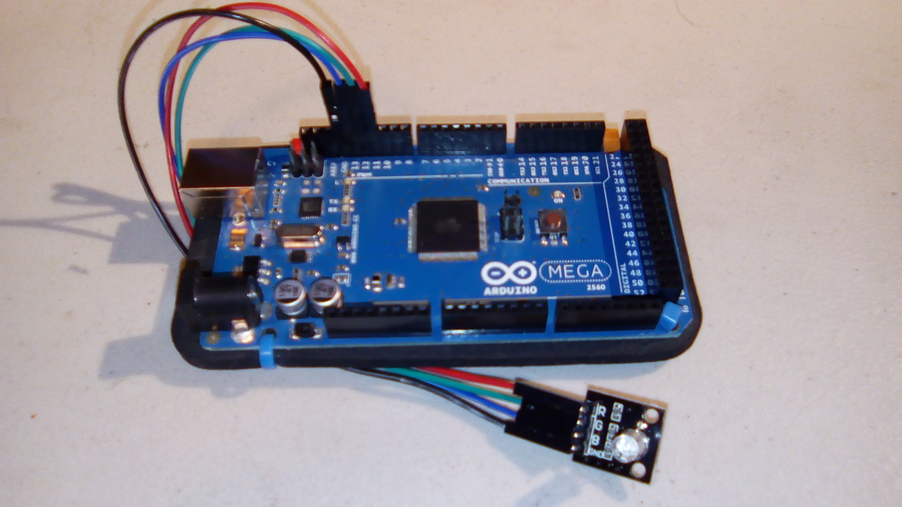

####Without wires:
(Front)
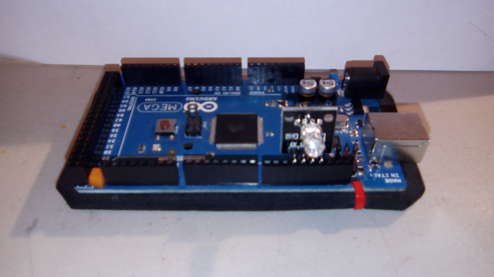

(top)

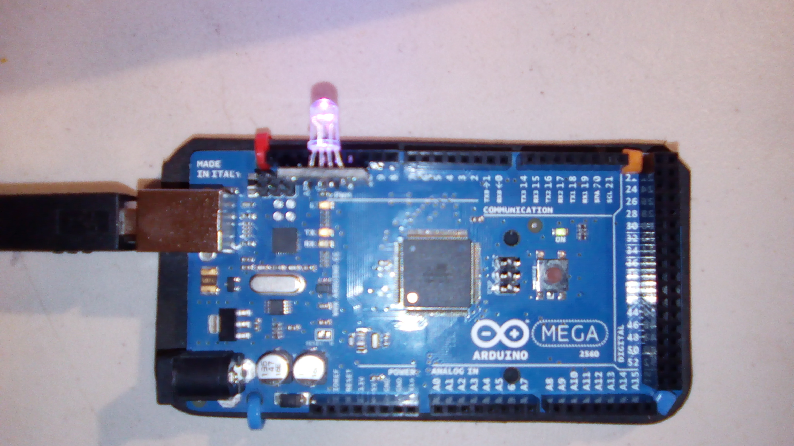

(back)
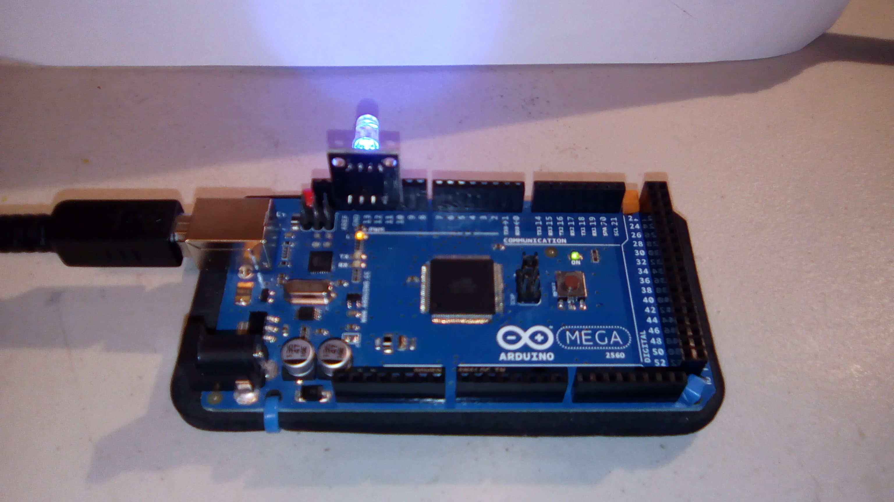

###A few pictures of the colors generated by the program.

####In these pictures, the colors were solid or mixed nicely

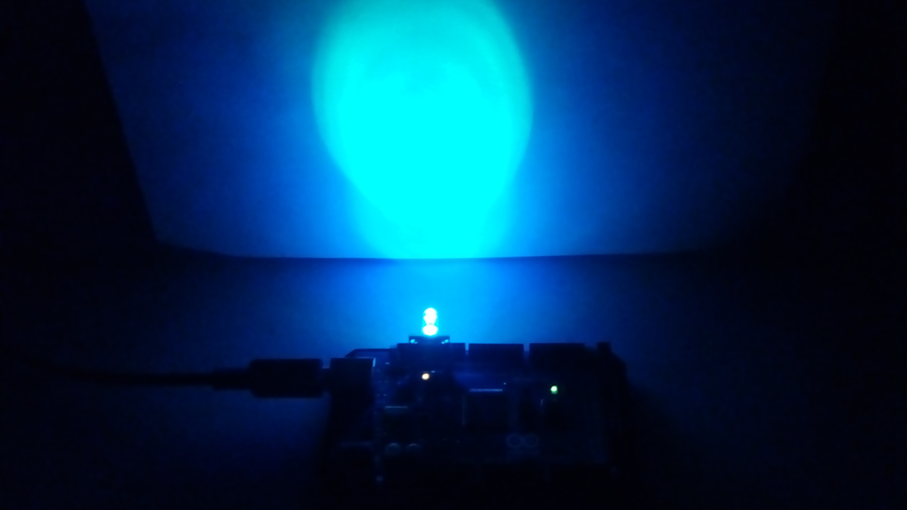

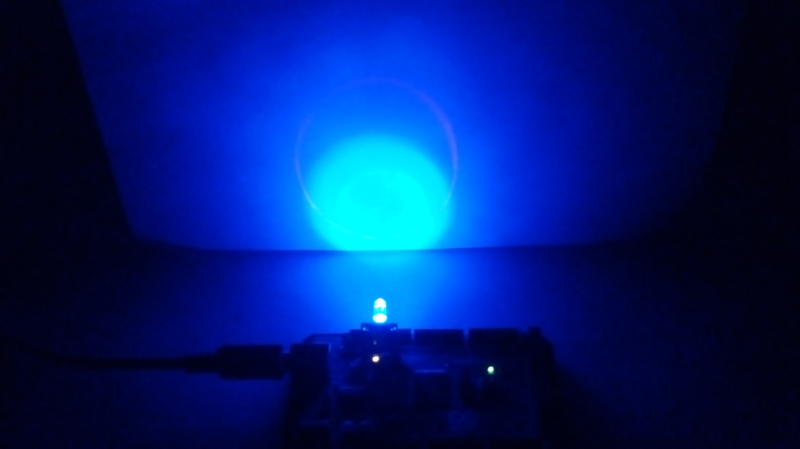

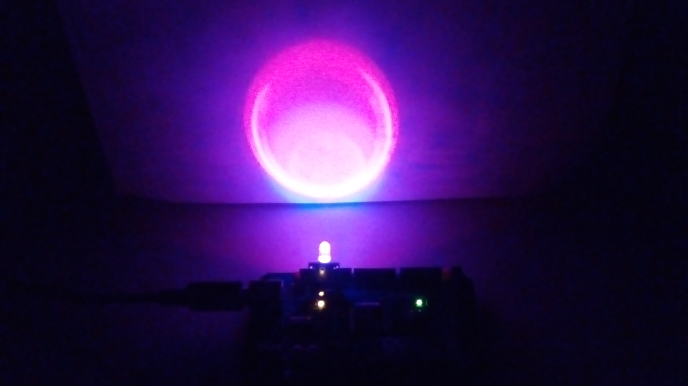

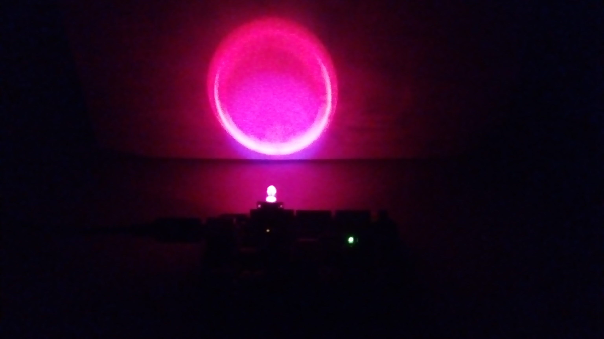

####In these, the colors didn't mix very well

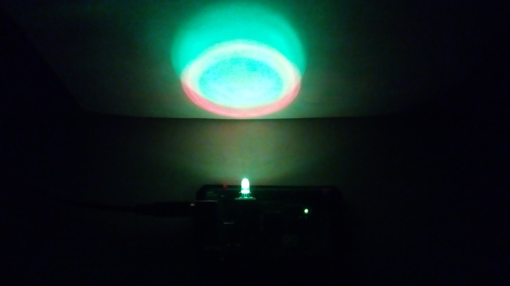

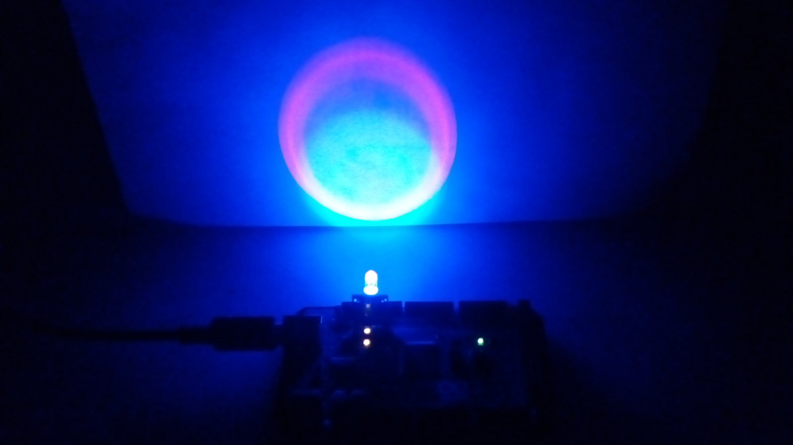

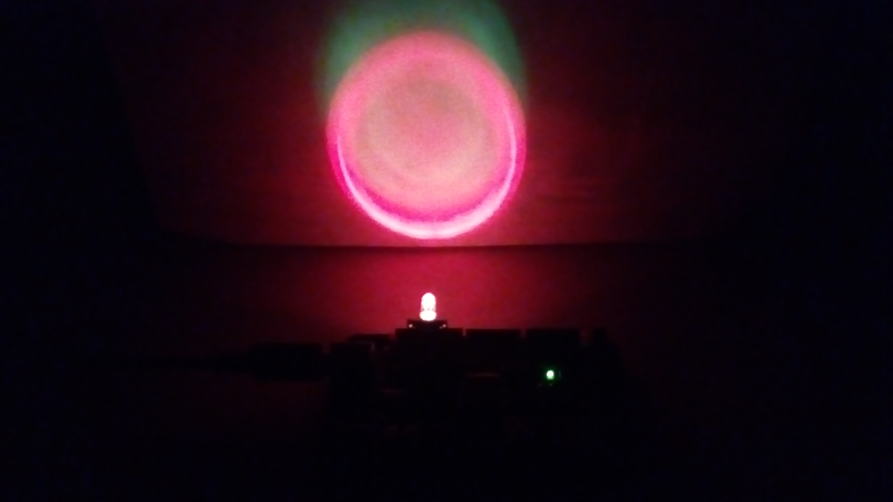

#### And this one is just a nice picture of the blue on the paper

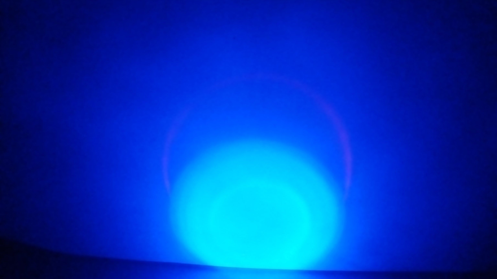

Apologies for the picture quality; these were taken with a phone camera.