#7 Color Flash LED

This is a demo of the 7 color flash LED.

There is no software. It runs on its own.

I have so many questions.

##Hardware
This uses the following wires:
- Red: 3.3V to `s`
- Black: GND to `-`

Leave the middle pin (`+`)empty.

With the LED pointing up, the pins from left to right are `S`, `+`, and `-`.

## Results

### In the light

Here it is, with the flash on the "off" period:

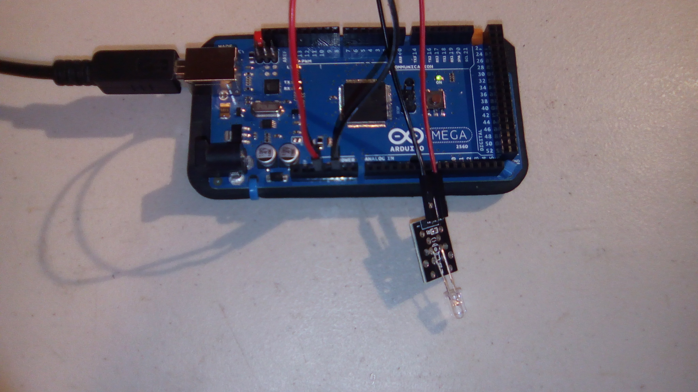

And here it is on the "on" period:

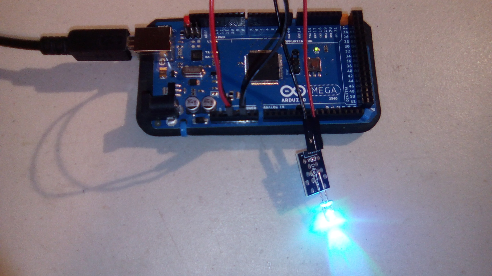

### In the dark

Note that not all possible color combinations have necessarily been recorded.

#### Single Colors

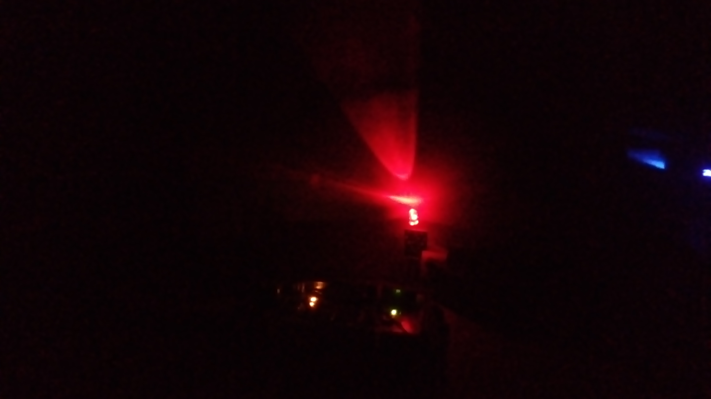

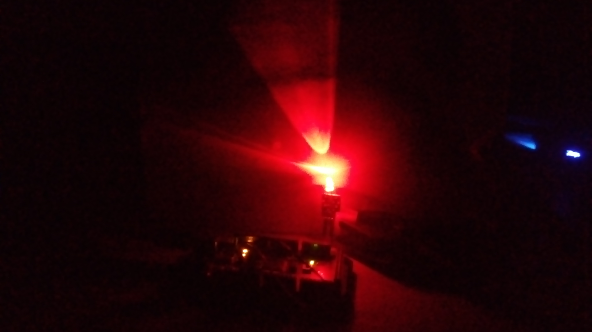

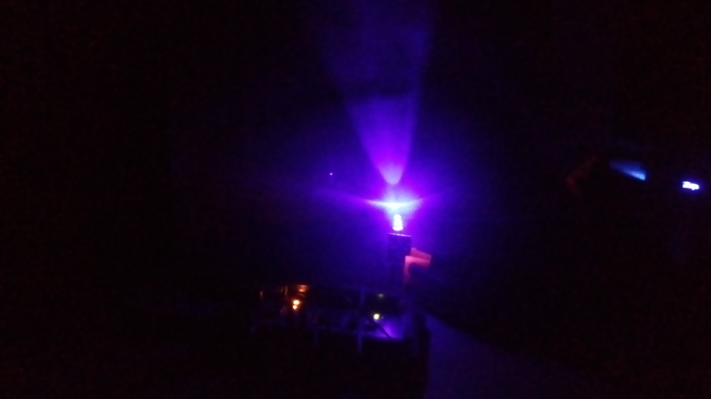

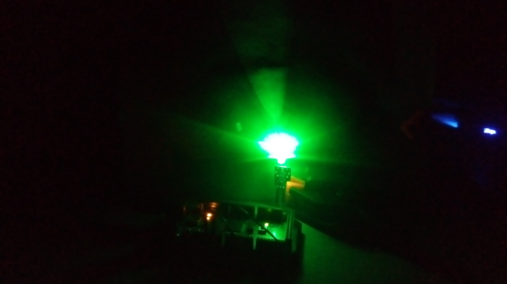

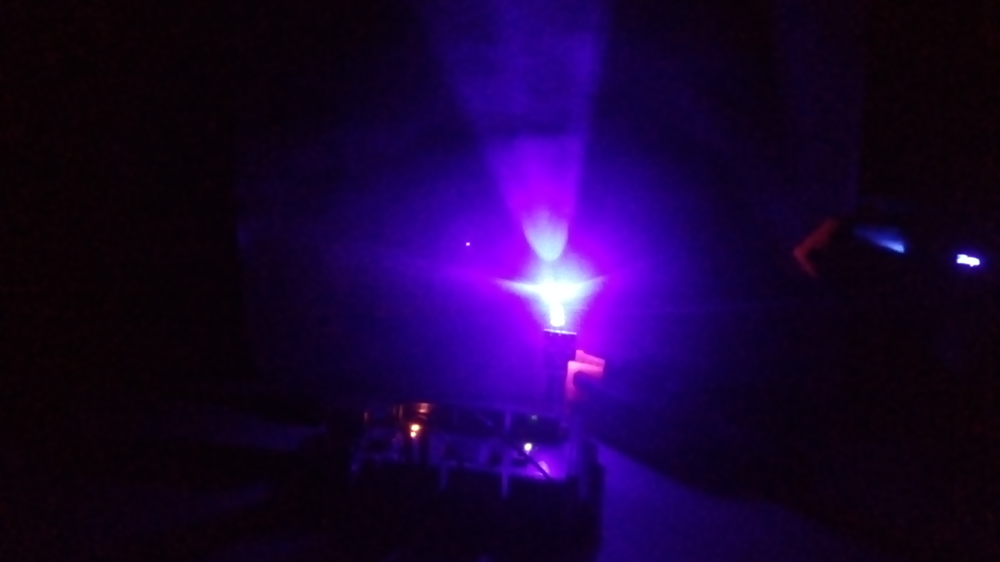

#### Two colors

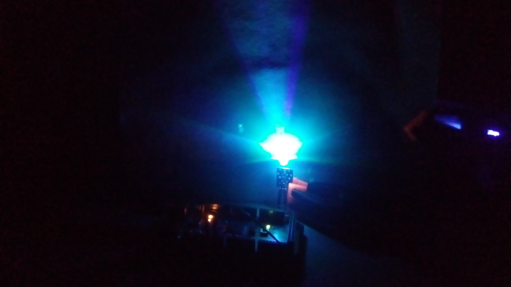

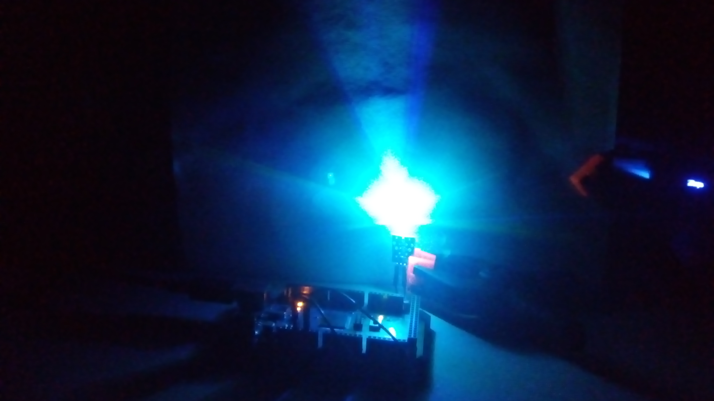

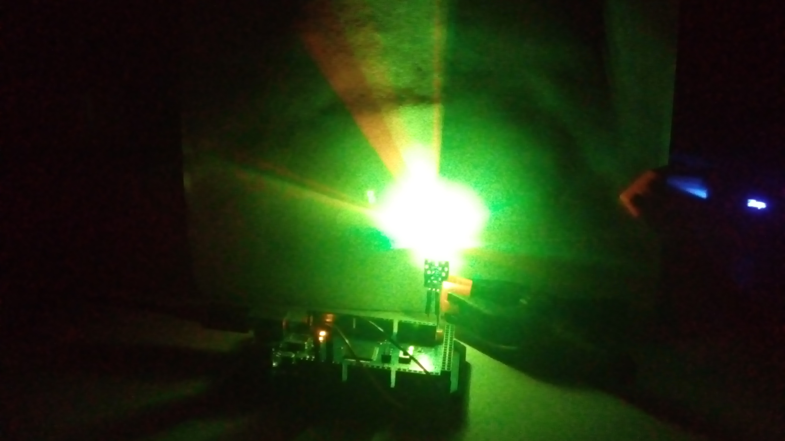

#### Three Colors

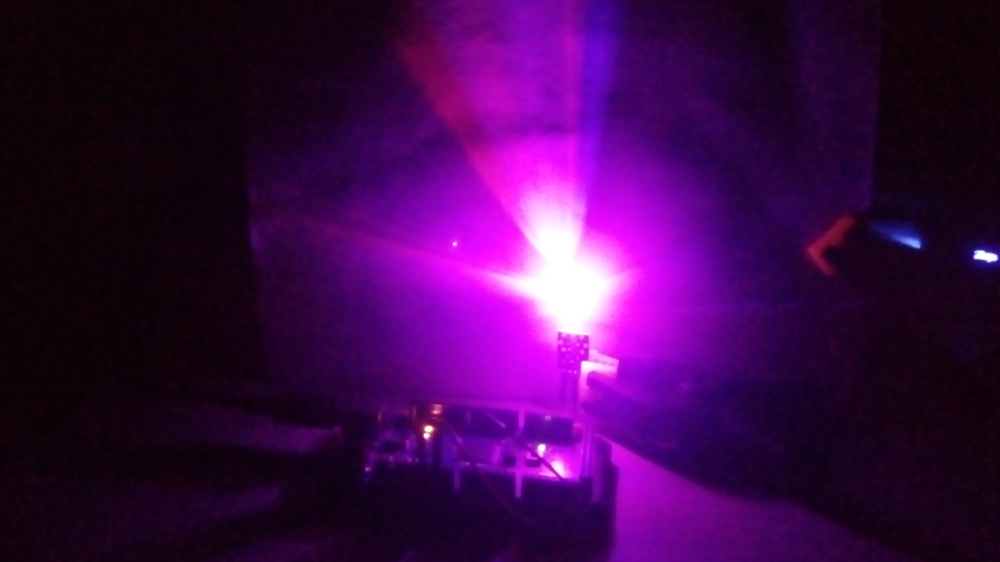

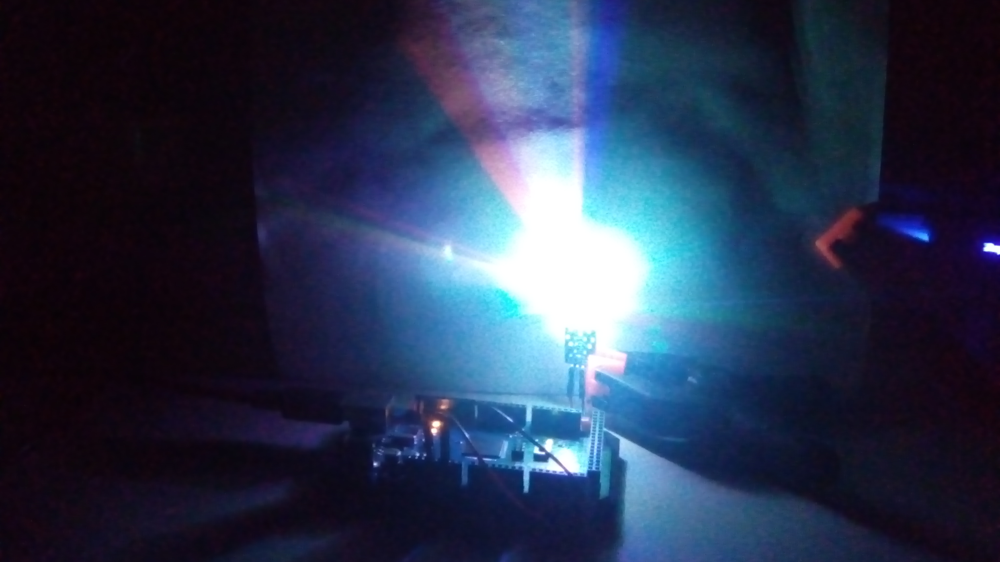

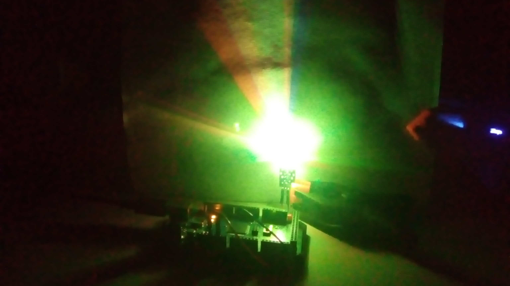

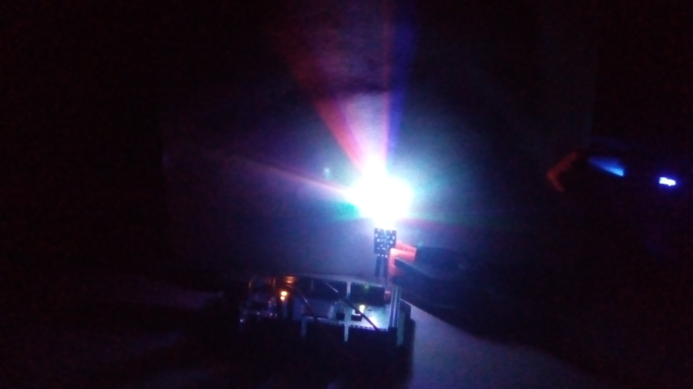

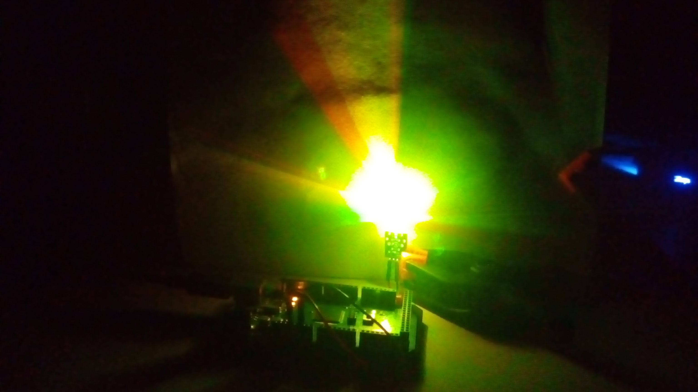

#### No color

Dark.

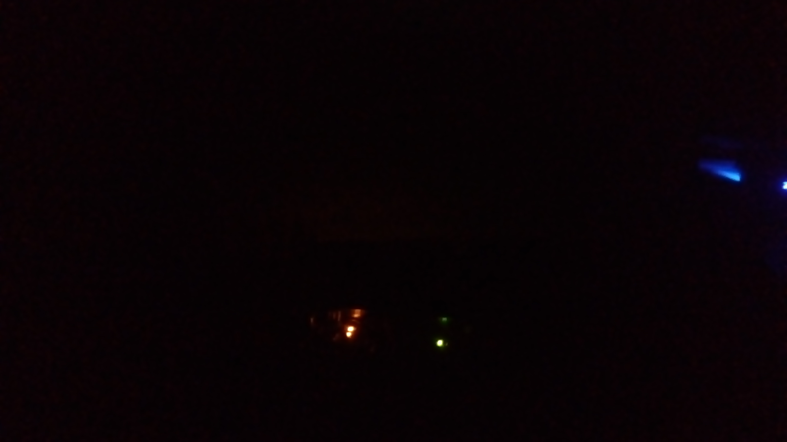

