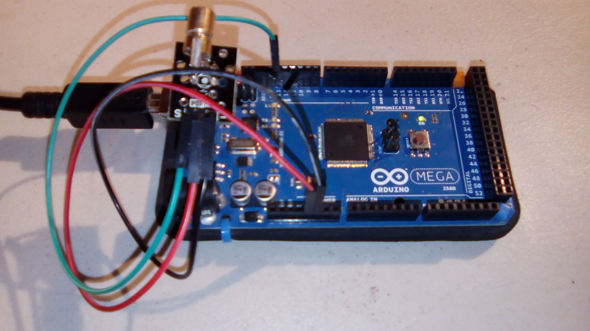
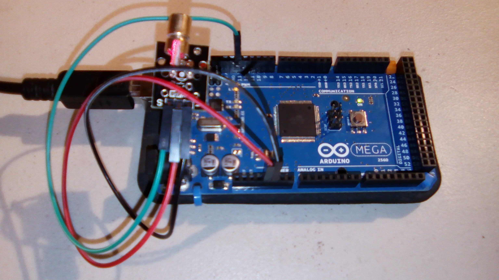

# Laser

This is a sample program for the laser. The code is approximately the same as on the website; see http://osoyoo.com/?p=640 . 

## Hardware
This uses the following wires:
- Red: 5V to laser
- Black: GND to laser
- Green: Signal output to laser

With the laser pointing up, the pins from left to right are signal, vcc, ground. 

This sketch uses pin 13 of an Arduino Mega for the signal, and the 5V and GND pins for power.

Laser off:

Laser active:

