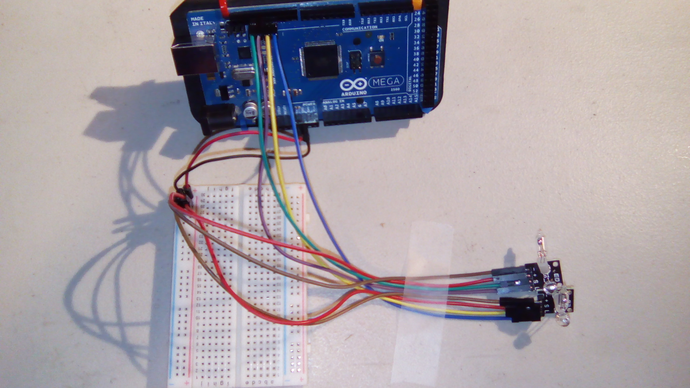
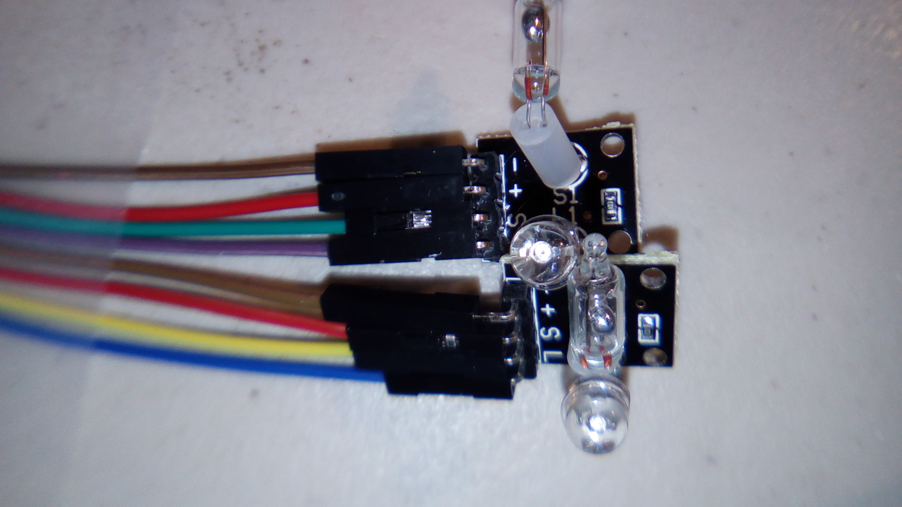
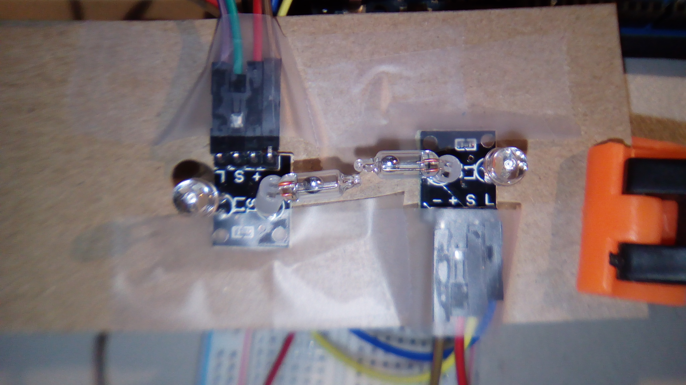
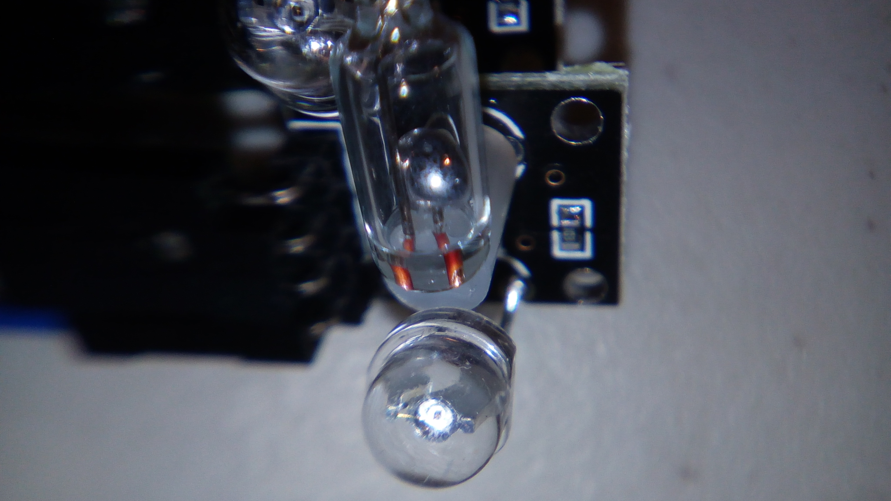
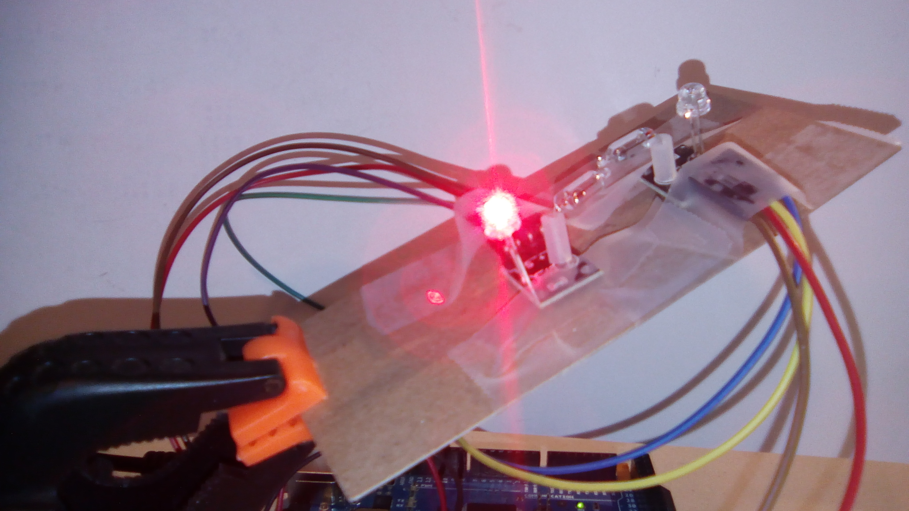
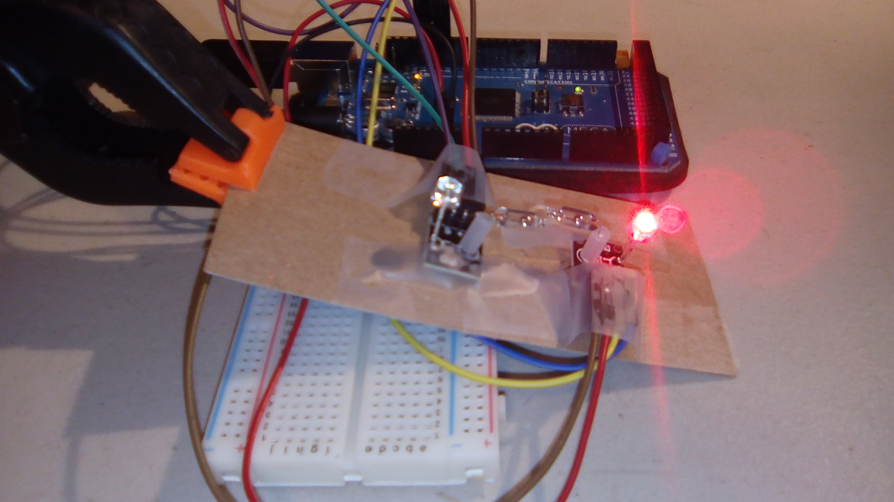
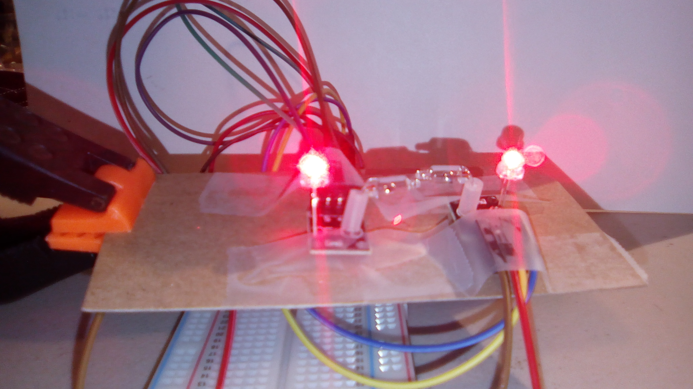

# Light Cups

This is a sample program for the light cups. The basic concept of the project code is the same as the provided code. 

## What's going on here?

Face the two cups towards each other (as shown in the [Placement](#placement) section), and tilt the assembly back and forth. 

These use a tilt switch to activate one and deactivate the other, depending on the tilt. The one that is below the other will begin getting brighter as the top one will become dimmer, theoretically giving the illusion that the light is pouring from one to the other.

If the two modules are not arranged as shown, this project won't work properly. The readings from the modules are taken individually, so it is possible for both to be doing the same thing at the same time, instead of opposite actions.

##
Hardware

This uses the following wires:

Arduino to breadboard:

- Red: 5V to `+` strip
- Black: GND to `-` strip

Arduino to modules:

- Green: pin 13 to module one `S` pin
- Purple: pin 12 to module one `L` pin
- Yellow: pin 11 to module two `S` pin
- Blue: pin 10 to module two `L` pin

Breadboard to modules:

-   Brown: `-` strip to `-` of each module
-   Red: `+` strip to `+` of each module

With the pins pointing down and the LED facing forward, the pins from left to right are `-`, `+`, `S`, and `L`.

The `S` pin is for the tilt Switch, the `L` pin is for the LED.

## Setup

### Wiring

This is the wiring, *not* how the light cup modules should be positioned. These pictures were taken for clarity of wiring.

### Placement

This is how the modules should be positioned. Note that in both the mercury is resting to the left. In one that means it's touching the contact; in the other the mercury isn't.

The mercury is that little bead of liquid metal shown below, in the long glass (plastic?) tube. The round glass (plastic?) piece on the bottom is the LED.

I *really* want to shake the switches to see if I can separate the bead of mercury, but I don't want to ruin the switch by not being able to reform the bead.

Oh well.

## Results

This shows them being tilted left. 

Tilted right:

If they are not set up well, then this (or the inverse) can occur:

#### Not shown:  

This is a semi-animated process. As one brightens, the other dims. 
