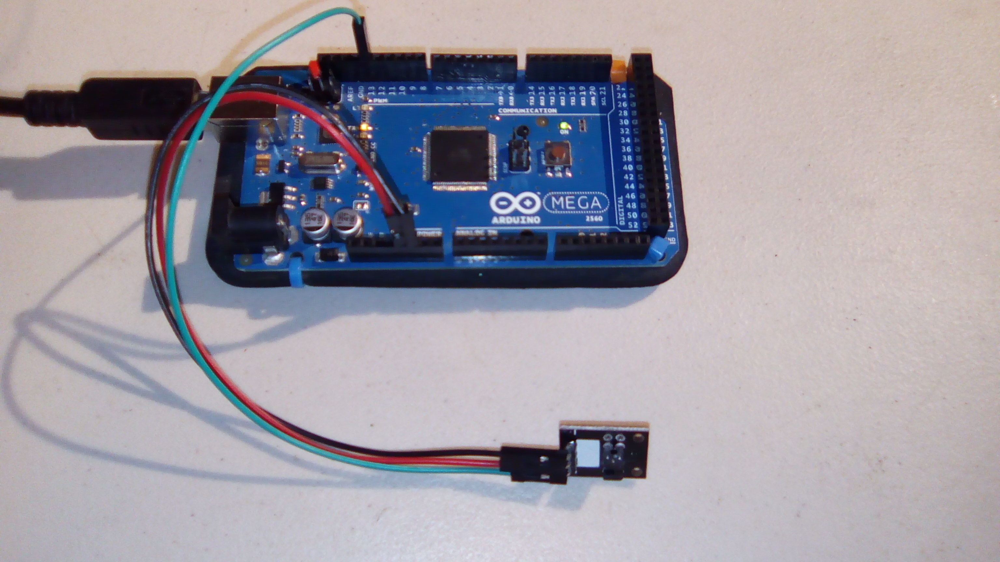
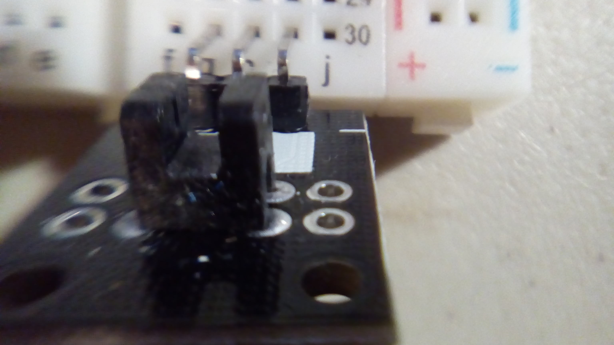
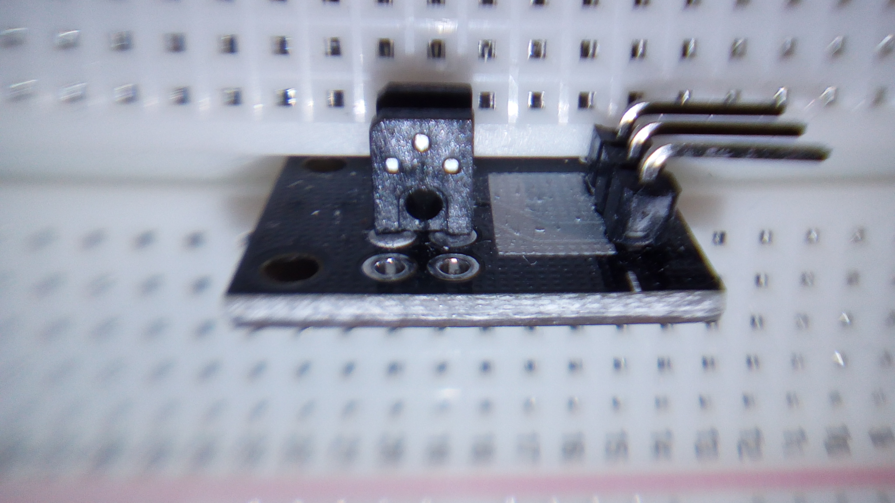
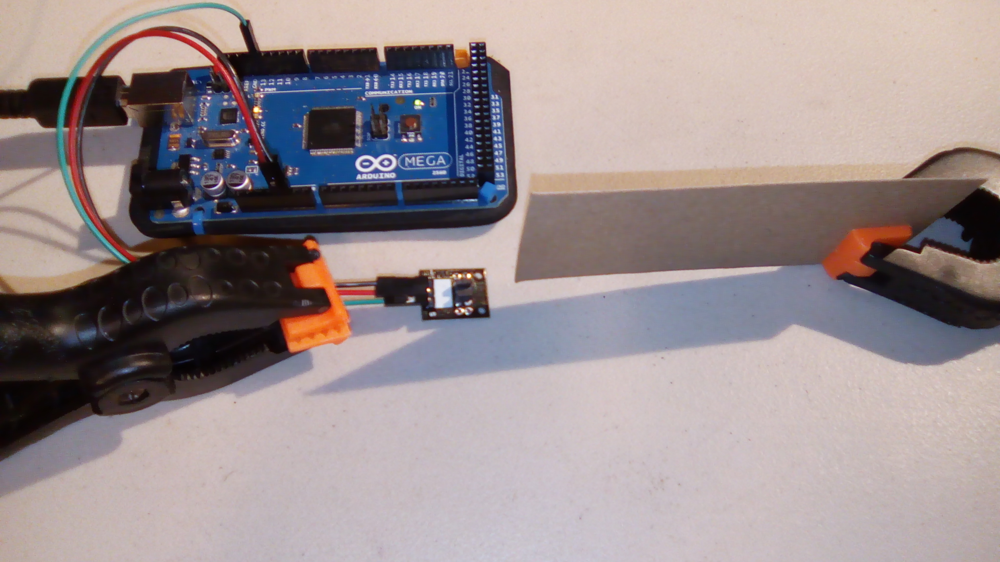
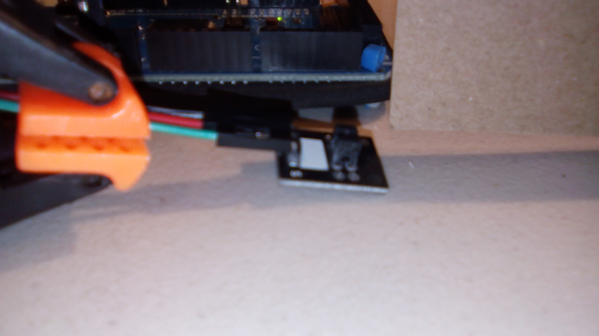
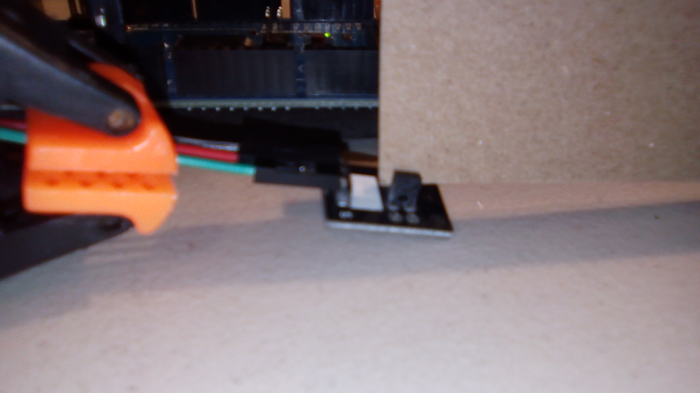

#Photo Interrupt Sensor

This is a sample program for the photo interrupt sensor. It appears to be an Arduino KY-010 Optical broken module.

Note that this is basically a switch, although a better use might be counting.

##Hardware
This uses the following wires:
- Red: 5V to VCC (+)
- Black: GND to GND
- Green: pin 13 to S

With the pins pointing down and the interesting side of the module facing you, the pins from left to right are `-`, `+`, and `S`.

## Module Overview

This is what the module looks like from the front. The sensor is between the two walls.

This is what the module looks like from the side. After taking a quick look around online I don't know what the little hole on the side is. Sticking something through it doesn't affect the readings. I suspect it might be there to make mounting something (like a mouse wheel) easier.

## Results

Cue the *Jaws* theme.

Without the card in the module:

Output: `No interrupt.`

With the card in the module:

Output: `Interrupted.`

