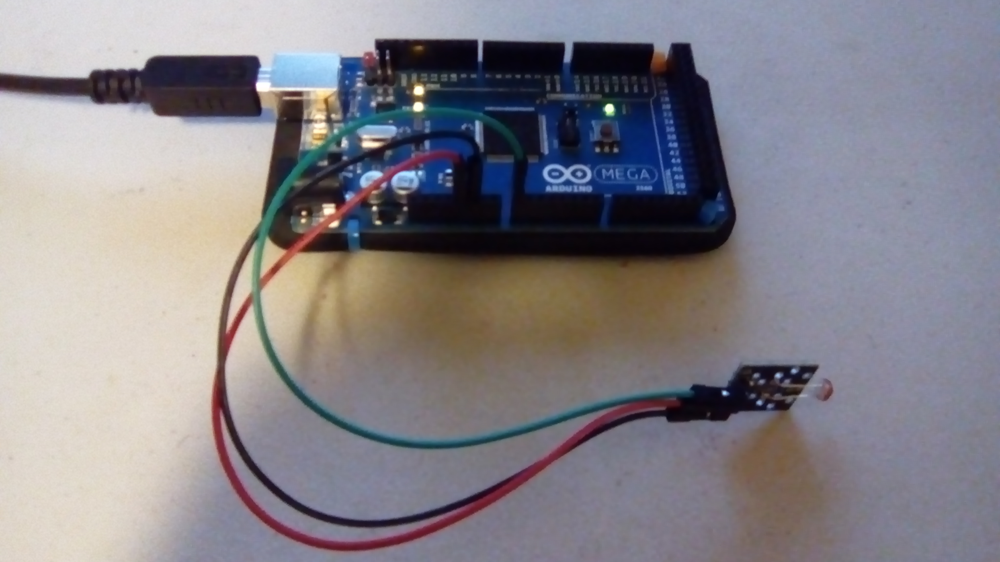
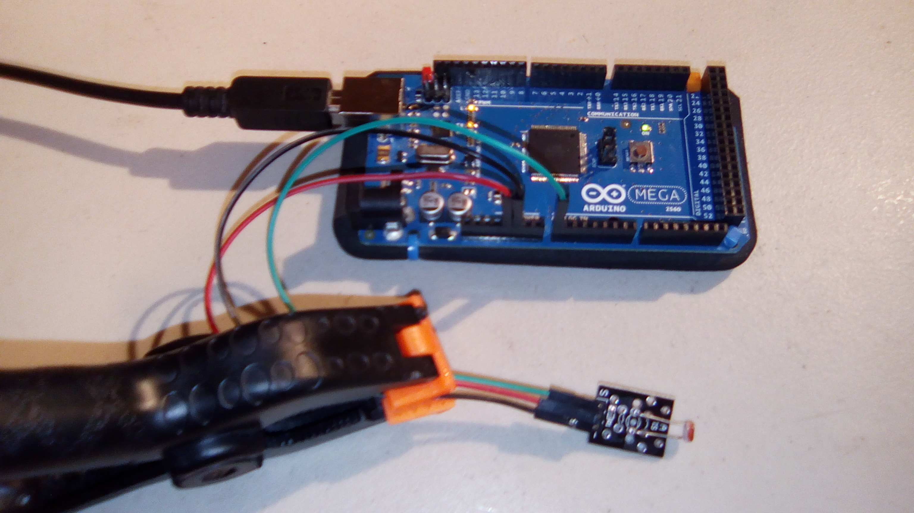
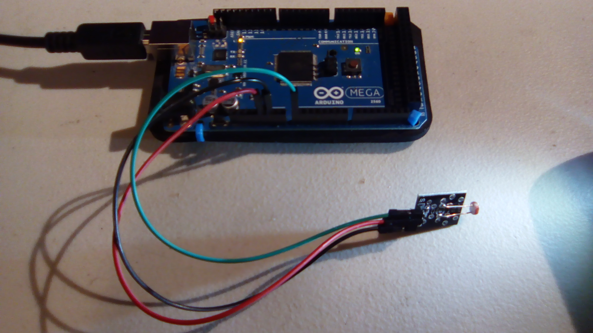
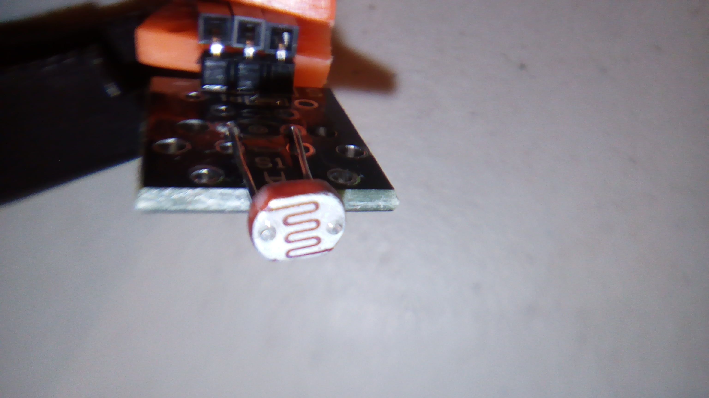

#Photoresistor

This is a sample program for the photoresistor.

The output has a range of 0..1023. The sensor measures darkness; that is to say, the number is higher the darker it is. This is inverted in the program by subtracting the detected darkness from the max darkness.

##Hardware

This uses the following wires:
- Red: 5V to middle pin (`+`)
- Black: GND to `-`
- Green: Analog pin A0 to `S`

With the pins pointing down and the interesting side of the module facing you, the pins from left to right are `S`, `+`, and `-`.

##Results
When the lamp is off: 
Sample output: `Brightness: 434`

When the lamp is on:
Sample output: `Brightness: 851`

When a flashlight is also used:
Sample output: `Brightness: 982`

##Other

This is what the front of the sensor looks like.

