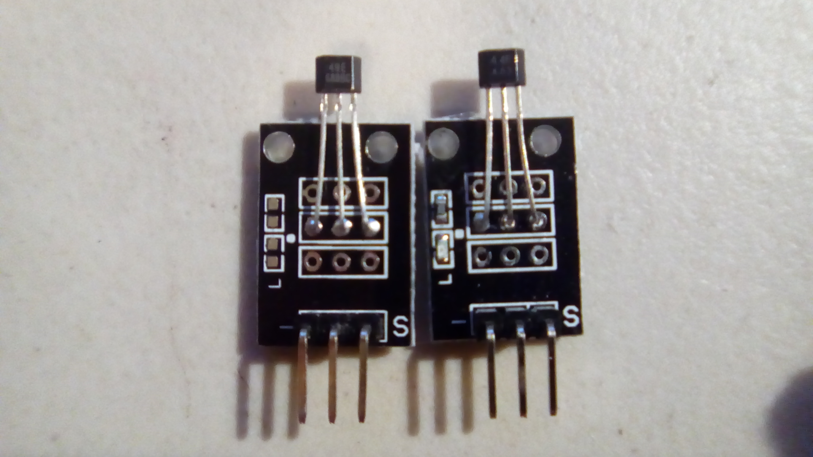

#Magnetic Sensors

This is a collection of sensors for magnetic fields. 

The reed and hall projects have the same code.

The two small hall sensors, the digital and analog, look almost identical. The difference is that the digital hall sensor has an LED on the top, which is an indicator for `ON` or `OFF`. The analog hall doesn't have any sort of indicator.

The digital hall sensor is on the right below.

Fun fact: I have an arduino uno controlling a power strip, which has my monitors + desk lamp plugged into it. When I was working with these sensors I accidentally uploaded a program to the uno instead of the mega, and the switch no longer worked (go figure). Fortunately I had some foresight when I made the switch and fail-proofed the hardware so that in case of failure the power strip is on.

