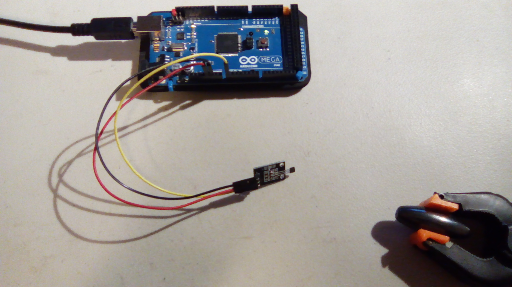
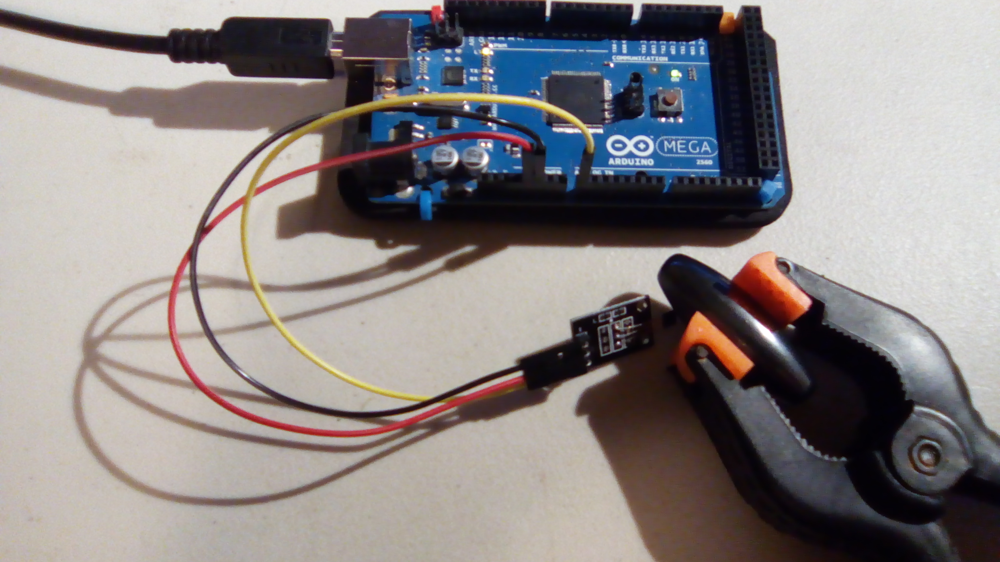
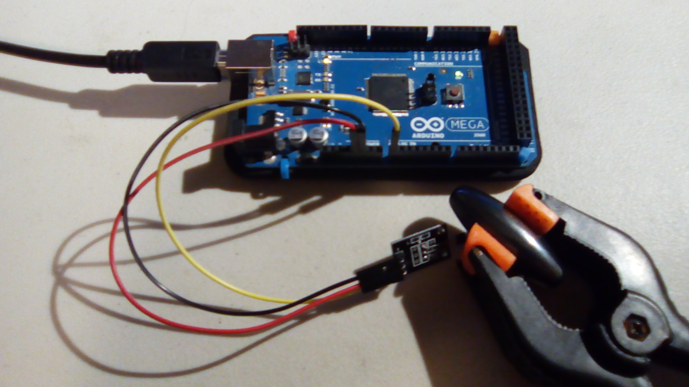

# Analog Hall Sensor

This is a sample program for the analog hall sensor.

## Hardware
This uses the following wires:
- Red: 5V to VCC (+)
- Black: GND to GND
- Yellow: Analog pin A0 to A0

With the pins pointing down and the interesting side of the module facing you, the pins from left to right are `-`, `+`, and `S`.

## Results

When the magnet is out of range:

Output: `Value: 527`

When the magnet is near, turned one way:

Output: `Value: 194`

When the magnet is near, but turned the other way:

Output: `Value: 864`

