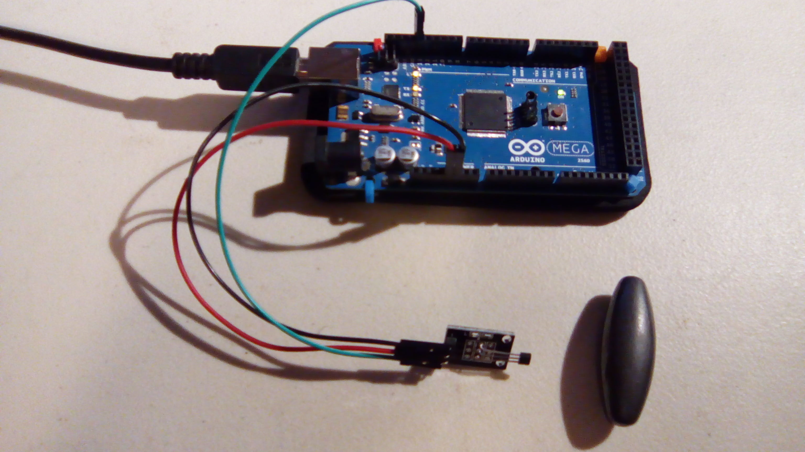
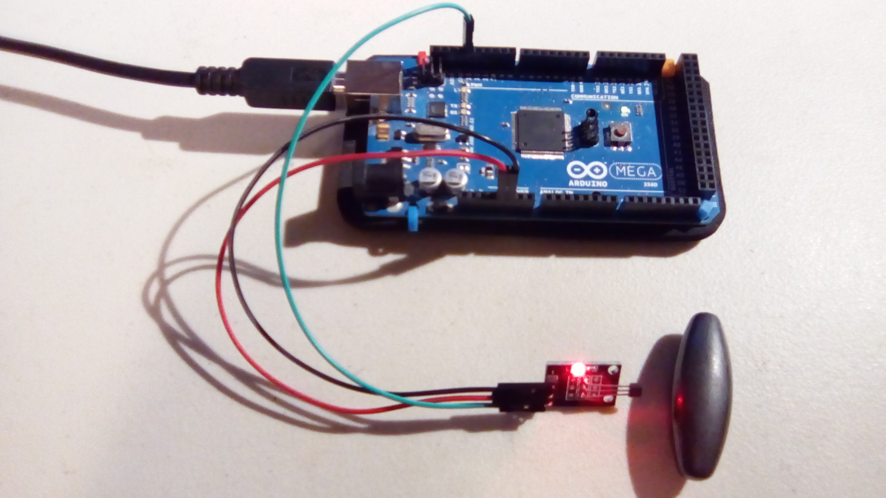

#Digital Hall Sensor

This is a sample program for the digital hall sensor.

Note that this is basically a switch.

##Hardware
This uses the following wires:
- Red: 5V to VCC (+)
- Black: GND to GND
- Yellow: pin 13 to S

With the pins pointing down and the interesting side of the module facing you, the pins from left to right are `-`, `+`, and `S`.

##Results

When the magnet is out of range:

Output: `No magnet detected.`

When the magnet is near, turned one way:

Output: `Magnet detected.`

