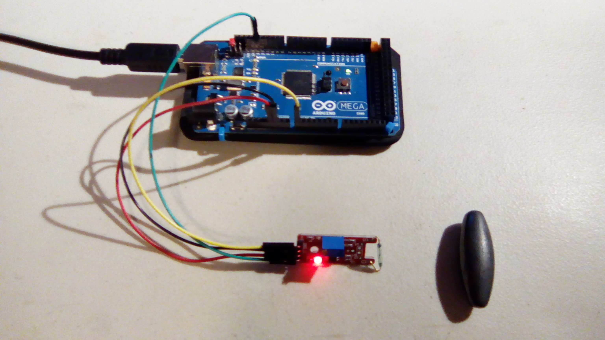
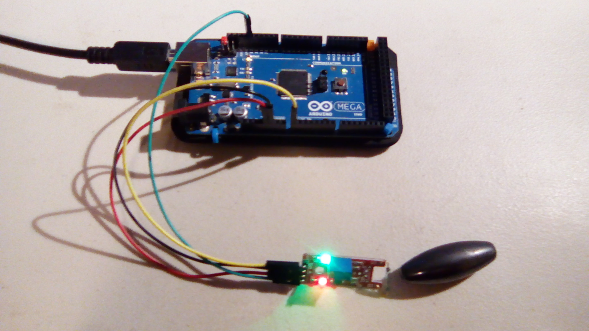

#Reed Switch

This is a sample program for the reed switch.

##Hardware

This uses the following wires:
- Red: 5V to VCC (+)
- Black: GND to GND
- Green: Digital pin 13 to D0
- Yellow: Analog pin A0 to A0

With the pins pointing down and the interesting side of the module facing you, the pins from left to right are A0, GND, +, and D0.

##Results
When the magnet is out of range:

Sample output: `Digital: off; Analog: 1023`

When the magnet is close:

Sample output: `Digital: on; Analog: 0`

The analog output seems pretty useless, only giving outputs of `0` or `1023`.