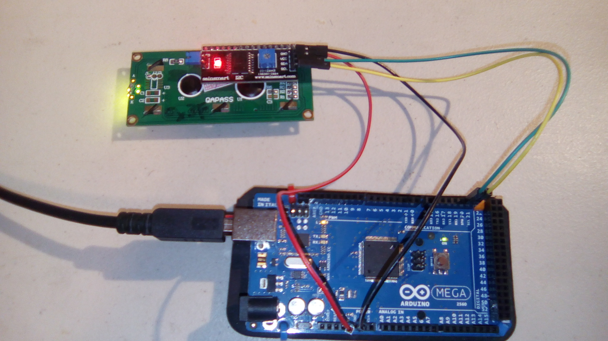

# I2C Scanner

This is a program to find the I2C address of a module. It was copied directly from http://playground.arduino.cc/Main/I2cScanner . 


## Hardware

This uses the following wires:
- Red: 5V to vcc
- Black: GND to gnd
- Green: SDA (pin 20 on an Arduino Mega) to SDA
- Yellow: SCL (pin 21 on an Arduino Mega) to SCL


Wiring on an example module:




## Results:

```
I2C Scanner
Scanning...
I2C device found at address 0x3F  !
done
```

Note, this will continue to scan every few seconds.
