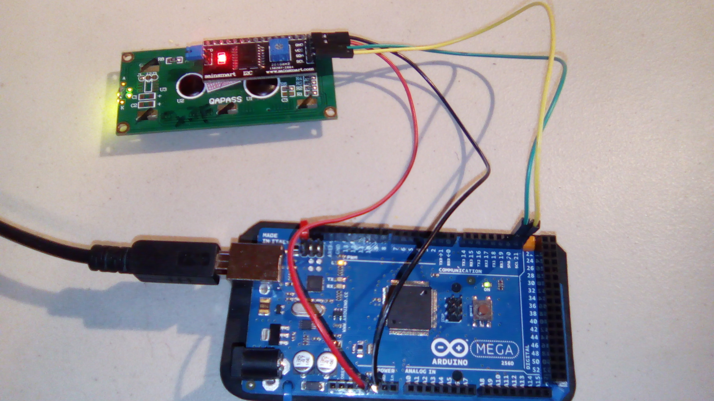
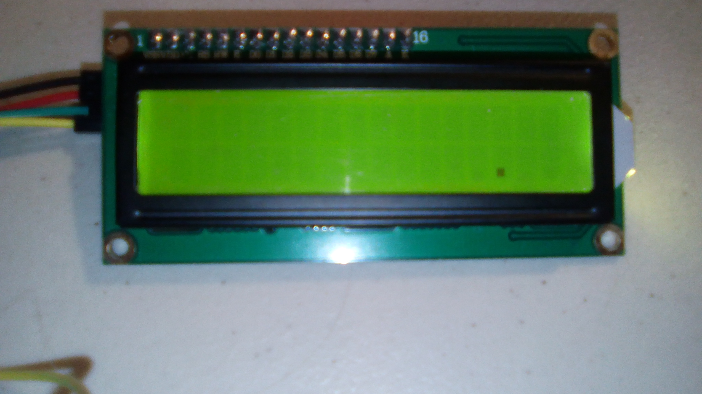
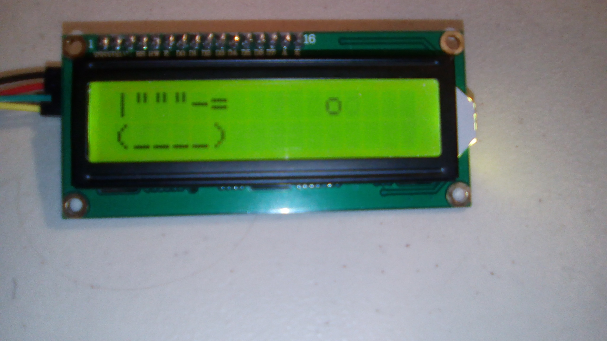
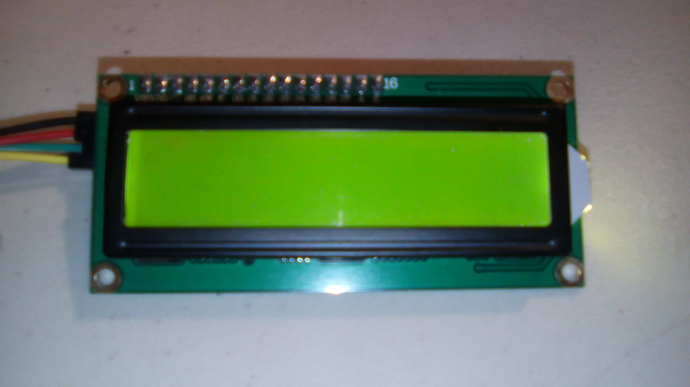
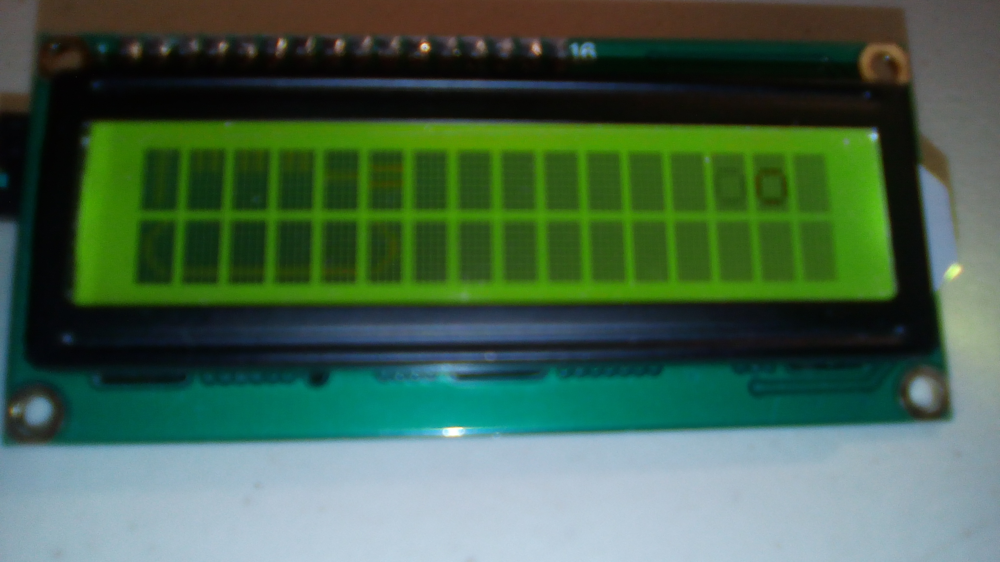

#I2C Scanner

This is a sample program for a Sainsmart I2C 16x2 LCD screen.

## Setup

This sort of follows instructions at https://forum.arduino.cc/index.php?topic=128635.0 .

##Hardware

This uses the following wires:
- Red: 5V to vcc

- Black: GND to gnd

- Green: SDA (pin 20 on an Arduino Mega) to SDA

- Yellow: SCL (pin 21 on an Arduino Mega) to SCL

With the pins pointing down and the screen facing away, the pins from left to right are SCL, SDA, VCC, and GND.

## Results:

There are two samples in this program. The first has a dot moving around the screen. The other is a tank, shooting o's.

## Possible Errors
There's a potentiometer in the back; make sure it's adjusted correctly. The potentiometer is the blue box with the little screw. Otherwise, you can have these two issues.

