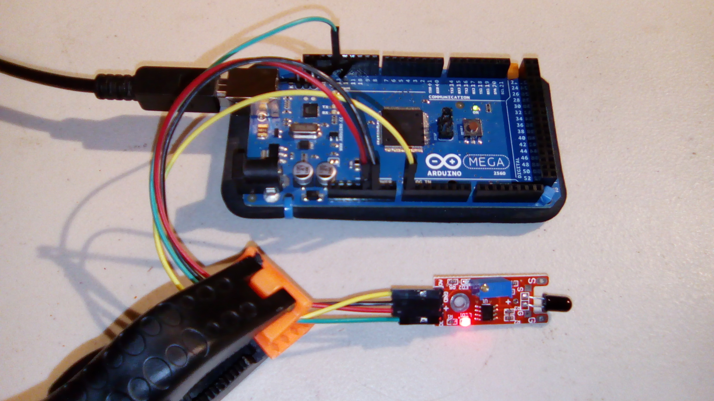
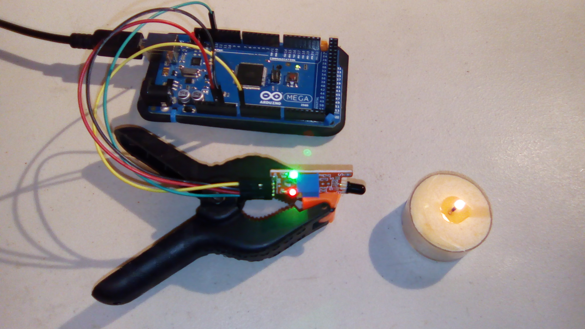
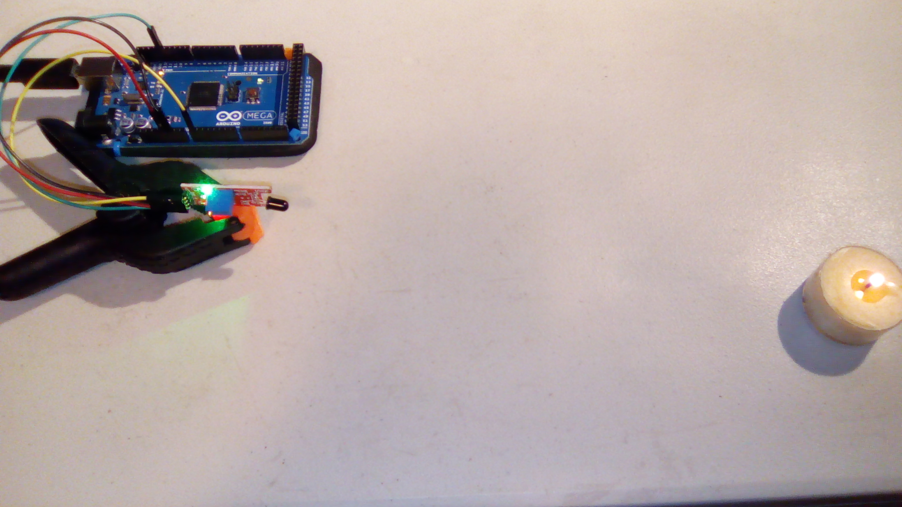

#Flame Sensor

This is a sample program for the flame sensor.

In the examples below, note that it works even though the flame is rather small. However, the sensor must be pointing at the flame to work. A few degrees can mean not detecting the flame.

##Hardware

This uses the following wires:
- Red: 5V to VCC (+)
- Black: GND to GND
- Green: Digital pin 13 to D0
- Yellow: Analog pin A0 to A0

With the pins pointing down and the interesting side of the module facing you, the pins from left to right are `A0`, `GND`, `+`, and `D0`.

##Results
When there is no flame:

Sample output: `Digital: off; Analog: 993`

When the flame is close:

Sample output: `Digital: on; Analog: 22`

When the flame is a bit further away:

Sample output: `Digital: on; Analog: 335`

