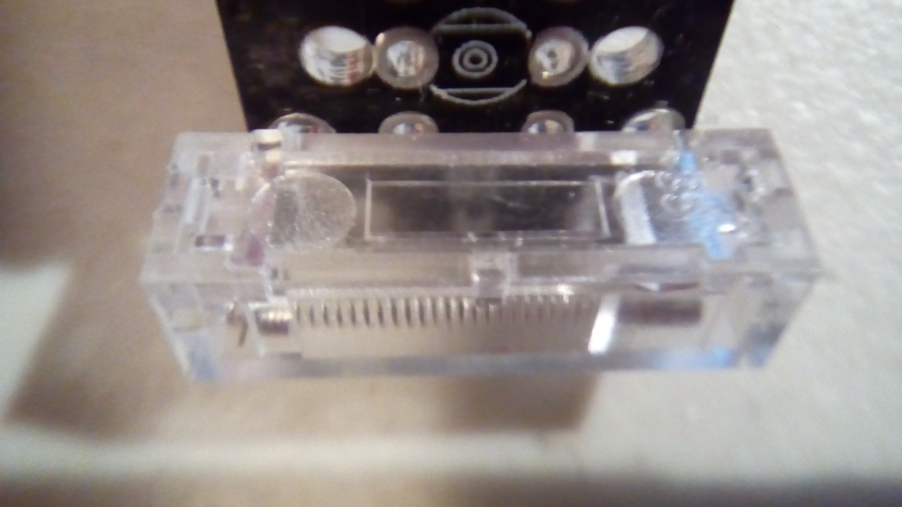
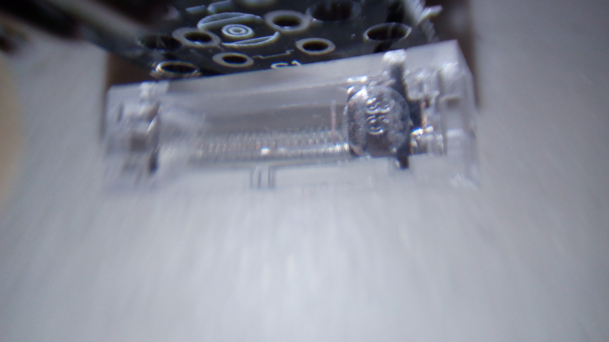
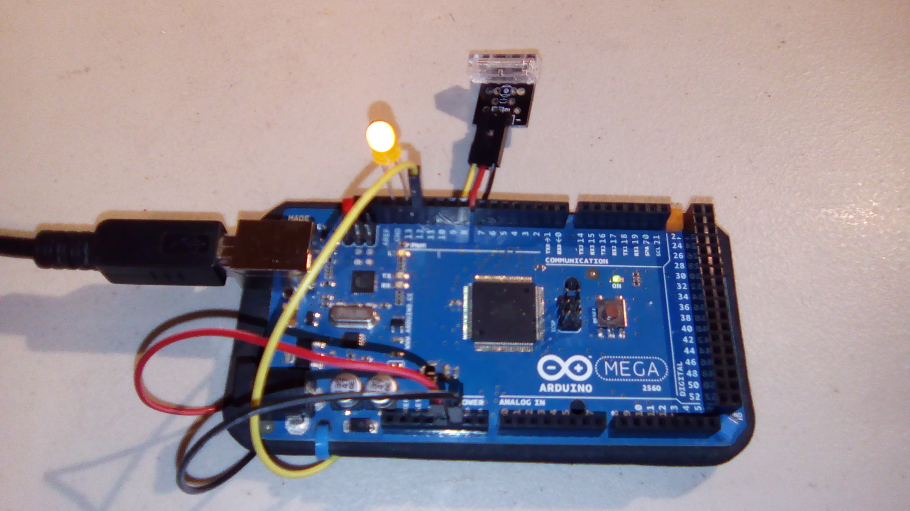
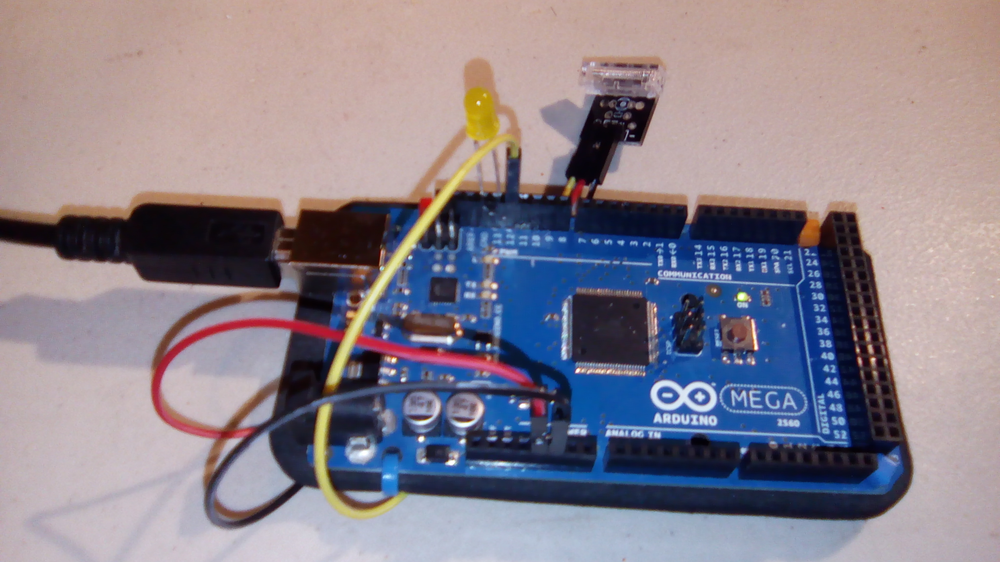

# hit sensor

This is a sample program for the hit sensor. The code is approximately the same as the provided code. 

Note, when struck the sensor outputs a signal of `LOW`, not `HIGH`. 

There is a 1 second delay after a change of input (struck vs not struck), because otherwise it would only output a `LOW` to the LED for the duration of the contact, which is *very* brief.

## Hardware
This uses the following wires:
- Red: 5V to middle pin
- Black: GND to GND (-)
- Green: Pin 13 to S

With the pins pointing down and the assembly facing you, the pins from left to right are Signal, VCC, and GND.

## How it Works

The sensor has a spring and a contact inside. When struck, the spring wiggles around and closes the connection with the contact.

This shows the spring and the contact. The contact is the metal plate on the right. The spring is only connected on the left, and sticks straight out.

This shows more detail on the contact.

## Results

When the sensor is just sitting around, chilling:

When the sensor has been struck (incident not shown):

