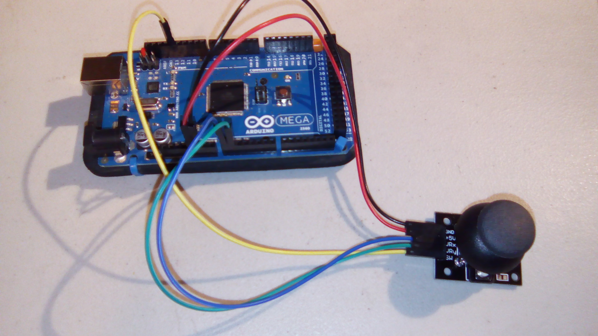

# joystick

This is a sample program for the joystick. The code is similar to that that provided with the module.

## Hardware
This uses the following wires:
- Red: 5V to +5V of joystick
- Black: GND to GND of joystick
- Blue: A0 (analog in) to VRx
- Green: A1 (analog in) to VRy
- Yellow: pin 13 to SW

With the joystick pointing towards you, the pins from left to right are GND, +5V, VRx, VRy, and SW.

Wiring:

## Results

Joystick idle:
`(0, 0, 1)`

When joystick is pushed all the way

down (as a button):
`(0, 0, 0)`

left (x axis):
`(-500, 0, 1)`

right (x axis):
`(523, 0, 1)`

up (y axis):
`(0, 510, 1)`

down (y axis):
`(0, -513, 1)`

The output can be any combination of these, with numbers within the range x=[-500, 523], y=[-513, 510], and z=[0, 1]. This has been adjusted in the program from the default ranges of ~ [0..1023] for x and y.
