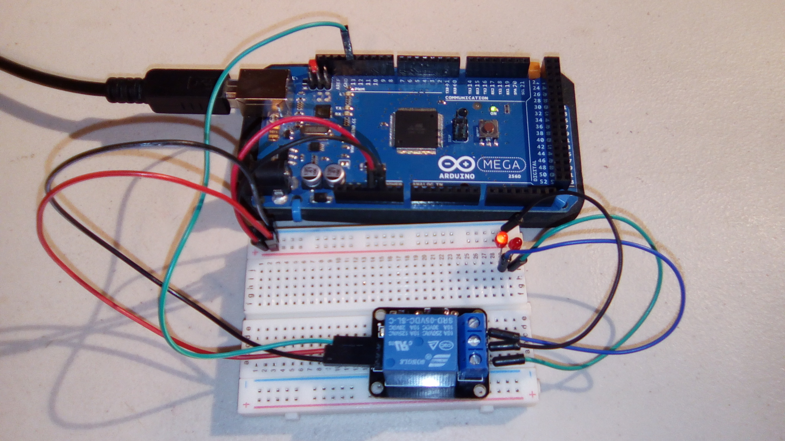
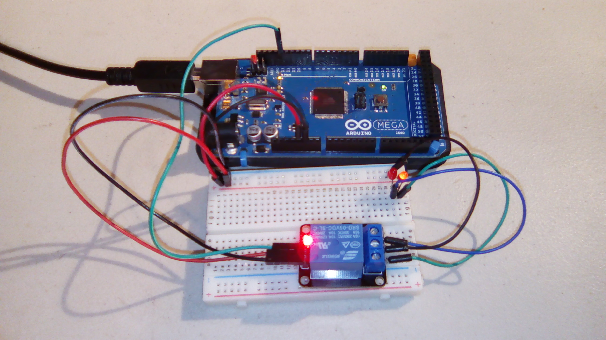

# Relay

This is an example program for the relay module. Example code and a tutorial can be found at http://osoyoo.com/?p=615 . 

## Hardware
This uses the following wires:
- Arduino:
  - Red: 5V to breadboard
  - Black: GND to breadboard
  - Green: Signal output to relay
- Relay:
  - Input:
    - Red: 5V in from breadboard
    - Black: GND from breadboard
    - (Green: Signal input from arduino)
  - Output:
    - Left pin (NC) (Blue) to left side LED
    - Middle pin (common) (black) to GND line of breadboard
    - Right pin (NO) (Green) to right side LED
- LEDs
  - Positive pins in positive line of breadboard
  - Negative pins to their respective inputs from the relay

With the relay pointing up (pins pointing down), the pins from left to right are signal, vcc, ground. 

This sketch uses pin 13 of an Arduino Mega for the signal.

### Explanation:

The relay controls a part of a circuit, similar to a light switch. When the relay is "closed", it means that the circuit is closed (ie, doesn't have any breaks in the circuit). When the relay is "open", it means that the relay "broke" one of the lines, so there isn't a full circuit. 

A relay like this uses a magnet inside to move a pin to close a circuit; this is why it clicks when it switches. When the signal to the relay is "LOW", it tells the relay to not do anything. Thus, the "normally closed" (abbreviated as "NC" on the board") side is closed (on), and the "normally open" (NO) side is open (off). When the signal is "HIGH", the relay will engage the magnet and switch which side is closed. This means that one side or the other will always be on.

This is an "active high" board, meaning that an input of HIGH or LOW will do as stated above. In an "active low" board, this will be reversed.

### Some notes:

- Your LEDs may require resistors.
- You may need to unplug the power or ground line to the breadboard when you upload the program to the arduino, to prevent a moment of high speed switching in the relay.
- The relay is resting on the breadboard, but not plugged in except by the noted wires.

Relay inactive:

Relay active: 

