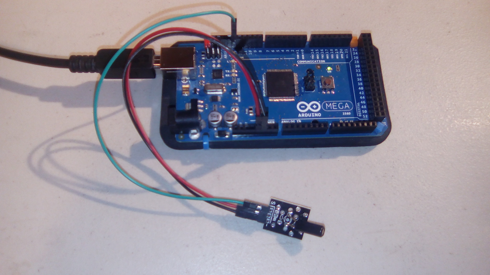
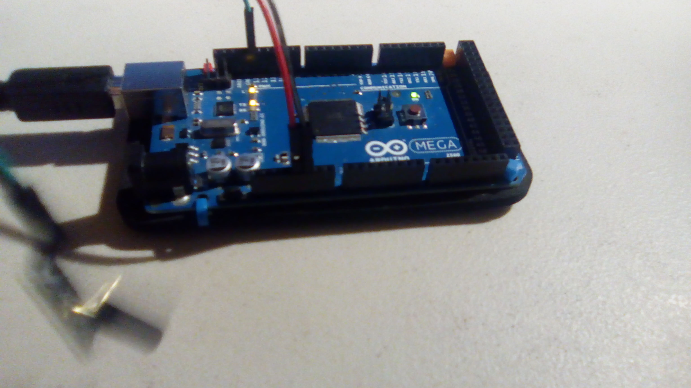
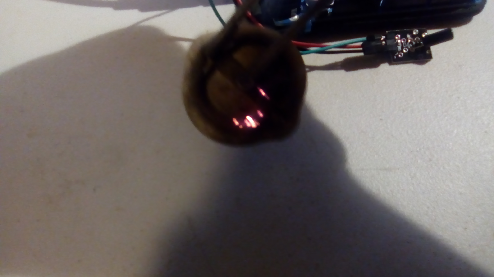
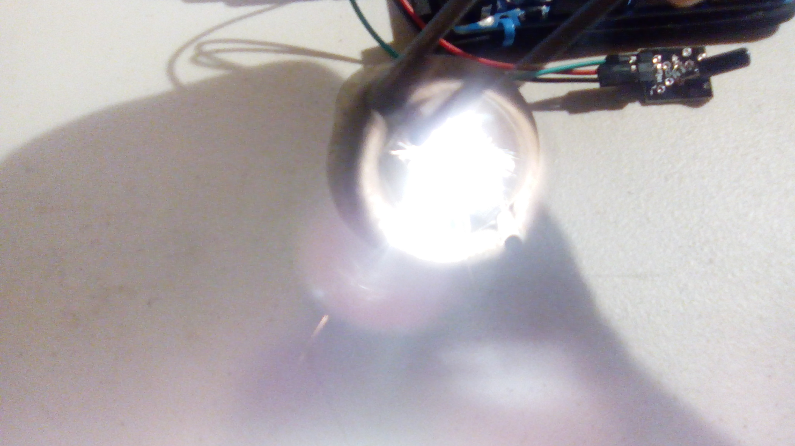

#Shock Sensor

This is a sample program for the shock sensor. By "shock", it means physical contact jarring shock, not an electric shock.

##Hardware

This uses the following wires:
- Red: 5V to middle pin
- Black: GND to GND (-)
- Green: Pin 13 to S

With the pins pointing down and the assembly facing you, the pins from left to right are S, VCC, and GND.

## Results

I would like to note that this is *not* a module to detect electric shock. I spent a while trying to zap the heck out of the module with no luck.

When the module is sitting quietly, minding its own business and recovering from the zapping, this is the output:

`I am unfazed.`

However, if I start shaking it:

`Woah, stirred, not shaken please.`

## Other

I would like to note that it's rather difficult to get a steady picture of the torch lighter in action. Here are a couple attempts.

Here we see what it looks like just after the sparks have flown off. So close to being a great picture, but so far.

Here we see a successful picture. I almost feel bad for putting the module through this.

