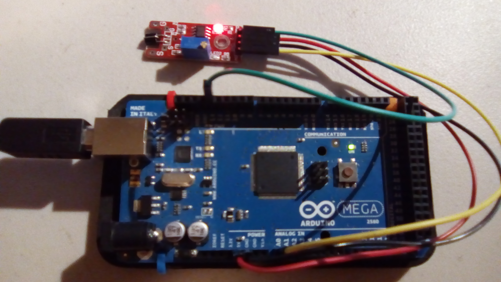
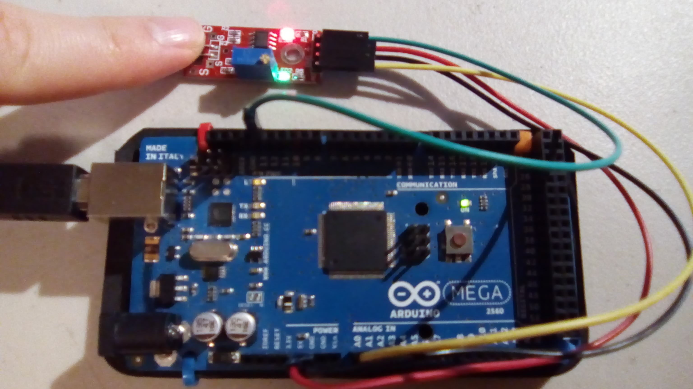
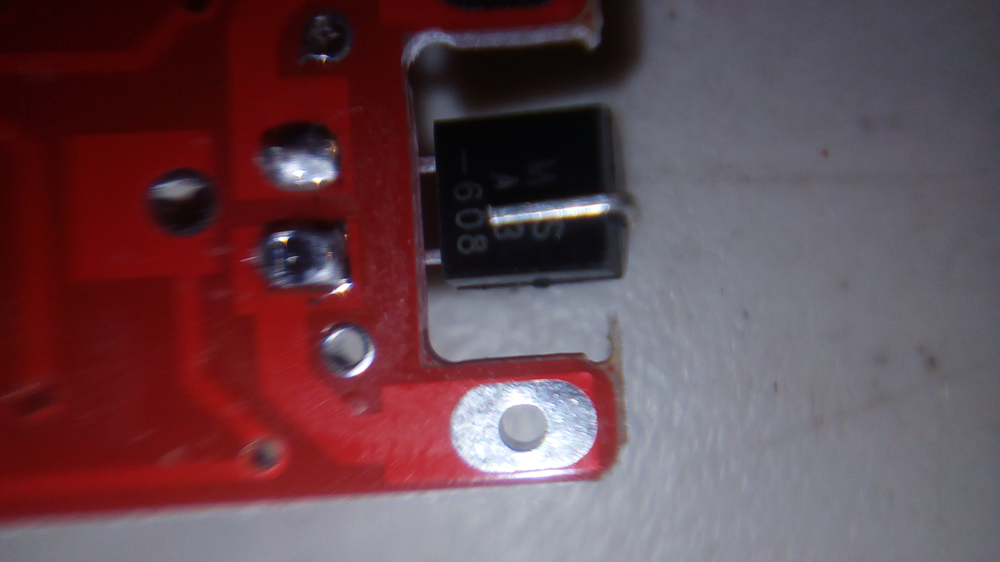
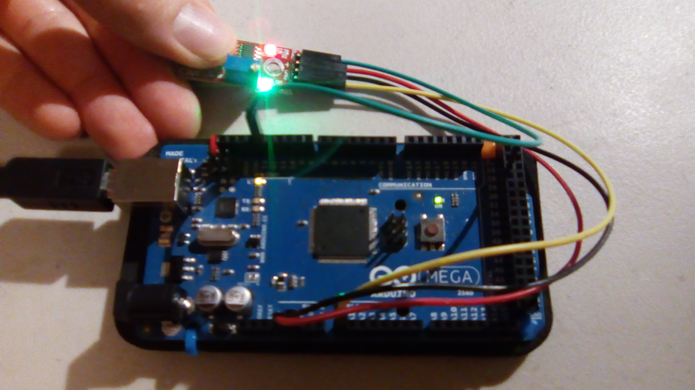

# Touch Sensor

This is a sample program for the touch sensor.

## Hardware
This uses the following wires:
- Red: 5V to VCC (+)
- Black: GND to GND
- Green: Digital pin 13 to D0
- Yellow: Analog pin A0 to A0

With the pins pointing down and the interesting side of the module facing you, the pins from left to right are A0, GND, +, and D0.

## Results
This is when there is no contact. Sample output: `Digital: off; Analog: 1023`
 

This is when the sensor is touched. Sample output: `Digital: on; Analog: 144`  

## Possible Issues

First of all, a prolonged contact (a few seconds) will be half ignored after the first little bit; the green indicator light will remain on (weakly), but the digital pin will output `LOW` and the analog pin will go back to giving `1023`. 

Be sure not to touch the two contacts behind the actual sensor (pictured below); that will force false readings.

This is the result of touching them. Yes, it detected it, but that's more of a bug being called a feature.

