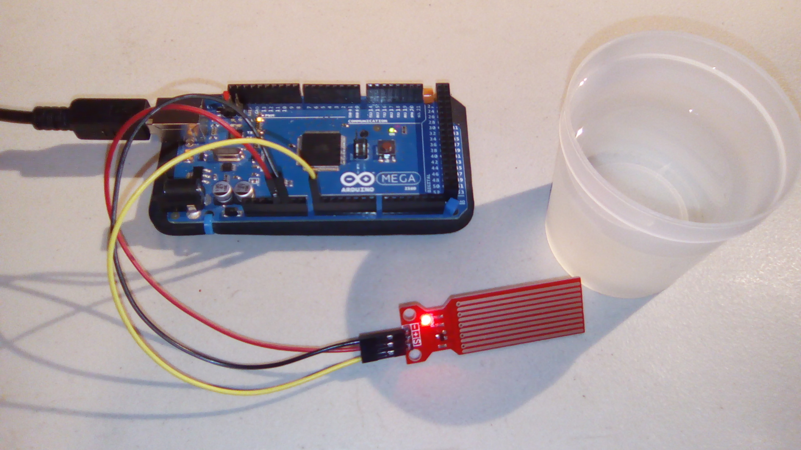
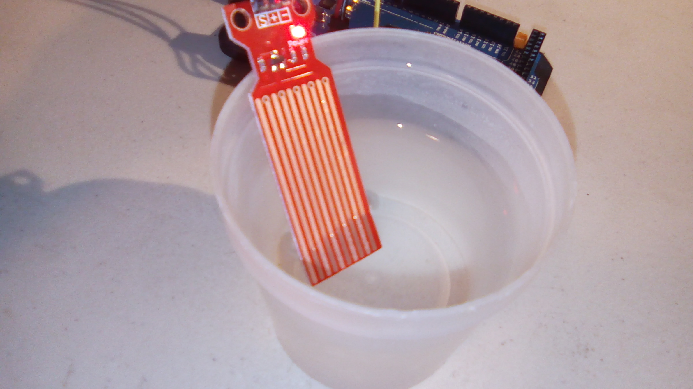
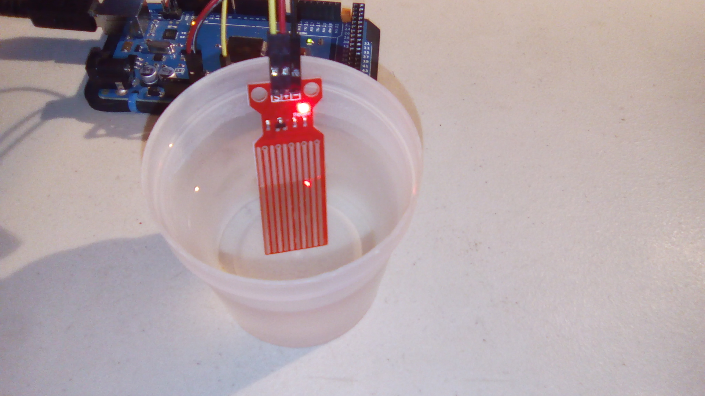
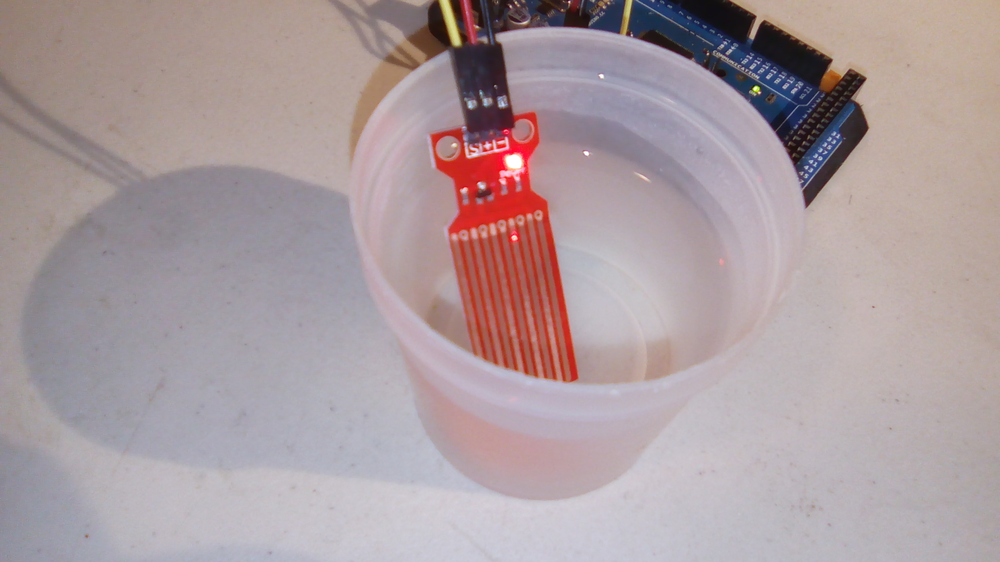
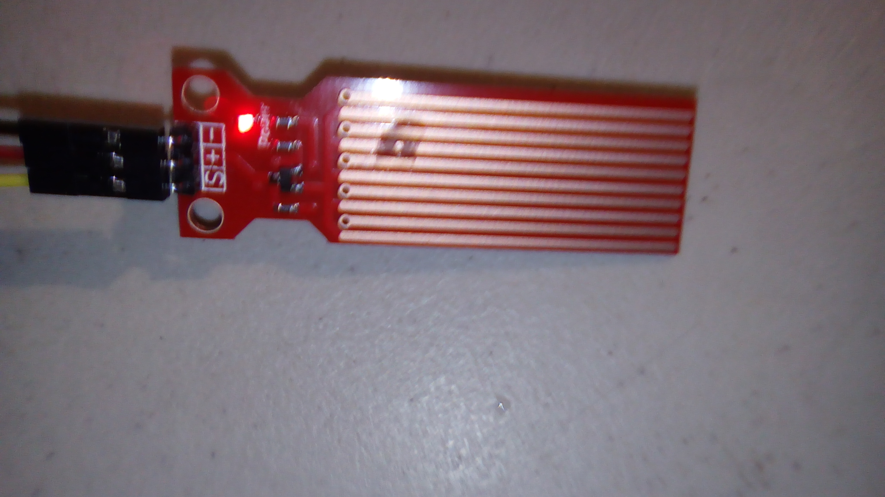
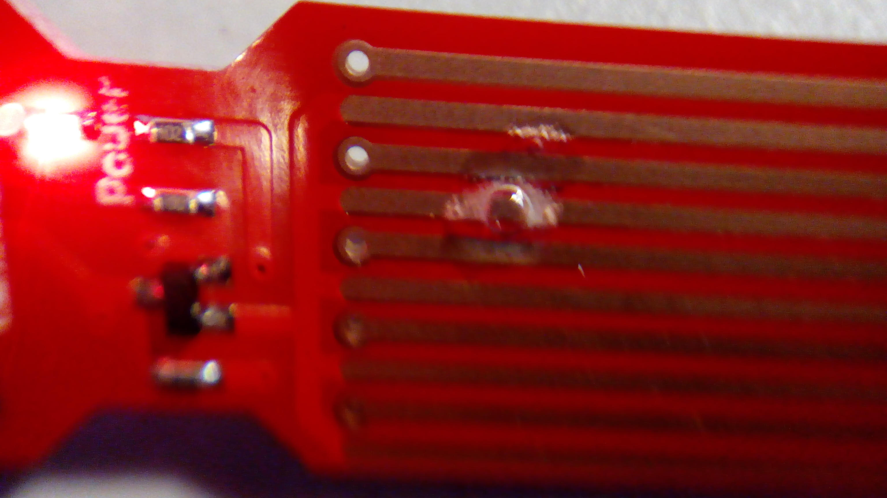

#Water Level Sensor

This is a sample program for the water level sensor.

##Hardware

This uses the following wires:
- Red: 5V to middle pin (`+`)
- Black: GND to `-`
- Yellow: Analog pin A0 to `S`

With the pins pointing *down* and the interesting side of the module facing you, the pins from left to right are `-`, `+`, and `S`. 

##Results

The sensor can definitely detect when it is (partially) in water. However, instead of giving a water level it seems to give a value close to its maximum possible value, minus a little bit. As the module is left in water the reading slowly climbs, as does the maximum possible value. Initially the value when semi-submerged is ~40, but after submerging the module to the end of the copper bars, and watching the max crawl to 400, the readings consistently hit close to 400 for any submersion. However, the numbers seem to drop back down after a while of being out of water.

Note that if there is water sitting on the module it will think it's partially submerged. It will give smaller values though, because there is less water on it.

Out of water, output is `Water level: 0`.

Here we see the module slightly submerged in the water. 

Initial output for this would be similar to `Water level: 100`

Here the module is, halfway submerged.

Here the module is, almost fully submerged. Output here would start around `Water level: 300`, but proceed to climb to at least  `Water level: 400`. I didn't exhaustively test this, so I don't know what the upper bound would be, but I would assume `1023`, as is usual for these modules. 

Here we see a drop of water on the module. Note that it's *fizzing*! I'm not sure what that means. The output for this was `Water level: 148`

