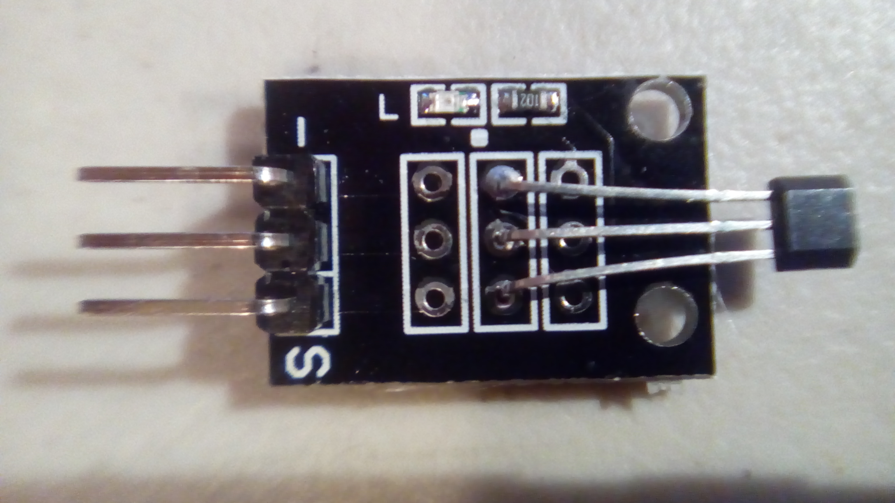

# Module Overview

These are the sensors / outputs at https://www.amazon.com/gp/product/B01CS6UMKQ . 

If the pictures seem distorted sometimes, there's a reason for that. My phone camera has less ability to focus than a goldfish, so I was using water to focus it. I put a droplet of water on the lens. This made the pictures *much* sharper, but meant that the pictures had to be taken straight down. The distortion is due to the shape of the drop.

You don't know the meaning of manual focus until you're adjusting the size of a drop of water on a lens.

## Contents

[Light Sensors](#light-sensors)

[Light Output](#light-output)

[Sound Sensors](#sound-sensors)

[Sound Output](#sound-output)

[Temperature Sensors](#temperature-sensors)

[Magnetic Sensors](#magnetic-sensors)

[Switches](#switches)

[Misc. Sensors](#misc-sensors)

[Misc. Output](#misc-output)

[Other](#other)

### Light Sensors

This uses IR to track objects.

This uses IR to avoid objects.

This is a heartbeat monitor.

This is an IR receiver. See also the IR emitter in the [Light Output](pictures/###Light Output) section.

This detects if the light beam going through it has been interrupted.

This detects the presence of light.

### Light Output
This is an LED with the three primary colors of light. In theory you could make all colors with this, but they don't mix very well.

This is a three color SMD (Surface Mount Device). It can output any color.

The following two pictures are of two color LEDs. There isn't much of a difference between them, and they can't really output the combination of the two colors.

This flashes / pulses in seven colors.

This shines a laser.

This emits IR.

These are "light cups". The idea behind these is basically to put the two tilt switches against each other, tip to tip, and rock both modules back and forth. This will trigger one switch but not the other, and the arduino can make it seem like light is pouring from one into the other by adjusting the brightness of each depending on their tilt.

### Sound Sensors
This detects small sounds.

This detects big sounds.

This uses ultrasonic sound to figure out how far away an object is, like a bat. It's accurate 1"-16'.

### Sound Output
The following are buzzers.

### Temperature Sensors
This detects both temperature and humidity.

These detect temperature, analog or digital.

### Magnetic Sensors
These are magnetic sensors.

### Switches
This has an internal ball and is used as a tilt switch.

This has a blob of mercury to close a connection.

These are reed switches. They activate on presense of a magnetic field.

This is a button switch. Must remain pressed to remain toggled.

### Misc. Sensors
This is both a gyroscope and accelerometer.

This detects fire.

This is a joystick.

This detects the presence of certain gasses.

This scrolls along the number line when twisted, and can be pressed as a button.

This detects being shocked.

This measures soil moisture. Not shown: the wires provided with it.

This detects water.

This detects being touched.

### Misc. Output
This is a relay module.

### Other
This is a real-time-clock module. It keeps the time, even when unplugged. 

This is an SD card reader.

This is a power supply, converting an input supply to 3.3V or 5V.

This is a step down module. It takes the input voltage and decreases it.

