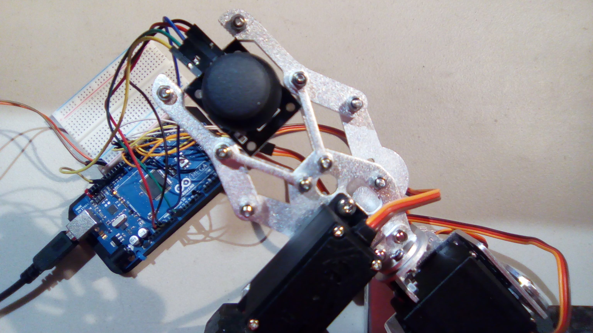

#Robot Arm

This is a simple program to provide joystick control to a robot arm. Based on my [demo joystick program](https://github.com/asinck/arduino/tree/master/misc/joystick).

##Hardware
This uses the following wires:

-   Joystick
    -   Red: 5V to +5V of joystick
    -   Black: GND to GND of joystick
    -   Blue: A0 (analog in) to VRx
    -   Green: A1 (analog in) to VRy
    -   Yellow: pin 13 to SW
-   Servos
    -   Yellow: +5V of breadboard to red wire of servos
    -   White: GND of breadboard to brown wire of servos
    -   Orange: pins 2, 3, and 4 to orange wire of servos
        -   2 --> bottom (elbow) servo
        -   3 --> middle (wrist) servo
        -   4 --> top (hand / gripper) servo
-   Breadboard
    -   +5V power supply to +5V line
    -   GND of power supply to GND line

With the joystick pointing towards you and the pins pointing down, the pins from left to right are GND, +5V, VRx, VRy, and SW.

Joystick Wiring:

Here's the top view:

And here's the "side" view:

Yes, I'm using a 10lb weight to pin it down. The arm is heavy and moves a lot.

At the arduino, the wiring looks like:

The "power supply" happens to be a Raspberry Pi car. It was what was handy. It's supplying +5V.

## Results

Output is in the format `(x, y, z)`. The defaults are `(90, 90, 1)`, with range of `[0, 180]` for `x` and `y` and values of `0` or `1` for `z`. 

When you control this, the wires on the joystick should be off to the right and the hand facing away from you. Otherwise, some controls might seem backwards.

Rotation of the joystick results in the expected elbow and wrist motion; pressing the joystick opens the hand (releasing closes it).

Here are some pictures. What these don't show very well is the range of motion of the arm. The range is ~90 degrees in either direction from the resting point.

In the next one it's pointing the hand down.

It has a good grip. Good enough to hold its own joystick. Definitely not trying to be Skynet. I totally implemented the Three Laws of Robotics.

