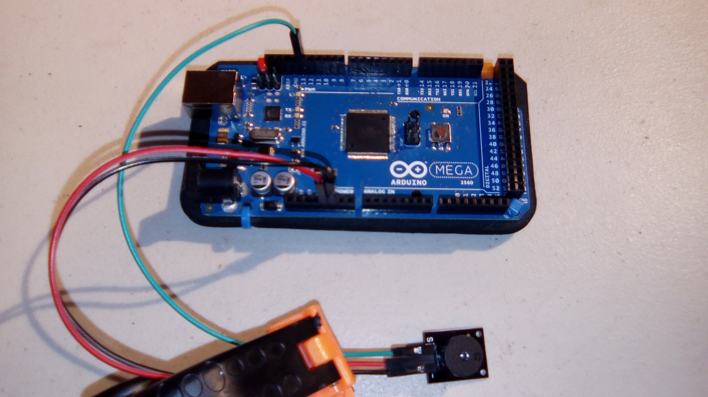

# Passive Buzzer

This is a sample program for the passive buzzer. 

**I would advise wearing earplugs or other hearing protection when using this buzzer. It's _LOUD_, painfully so.**

## Hardware
This uses the following wires:
- Red: 5V to middle pin
- Black: GND to GND (-)
- Green: Pin 13 to S

With the pins pointing down and the buzzer facing you, the pins from left to right are Signal, VCC, and GND.

**Not shown:** the sound.
