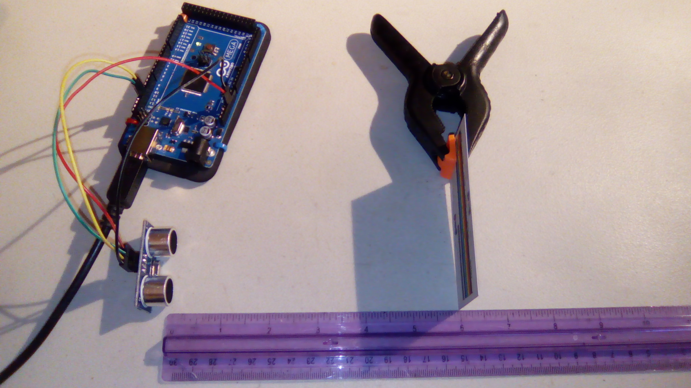
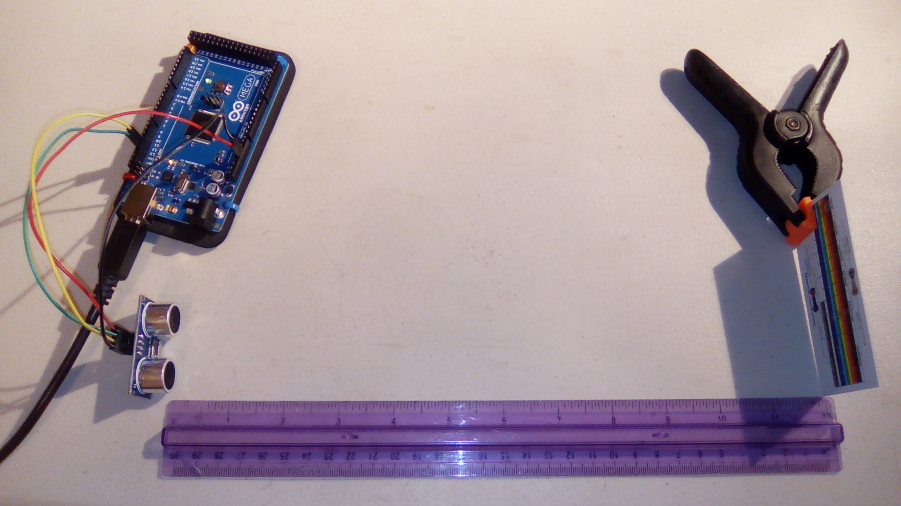

# Ultrasonic

This is an example program for the ultrasonic module. Adapted from the code included with the module.

## Hardware
This uses the following wires:
- Arduino:
  - Red: 5V to VCC
  - Black: GND to GND
  - Green: Signal to Trig
  - Yellow: Signal to Echo

With the pins pointing down and the "speakers" facing up, the pins from left to right are VCC, Trig, Echo, and GND.

## Explanation:

This uses sound waves to decide how far away objects are. It pulses a sound wave and then listens for the echo. The longer it takes to hear its own echo, the further away the object is.

## Final Product
This is the sensor detecting a card 6" away from it. It's a resistor color code chart card, if you're wondering.

Output: `Distance to object = 15.40 cm / 0.51 ft / 6.06 inches`

This is the sensor detecting a card 1' away from it. 

Output: `Distance to object = 30.60 cm / 1.00 ft / 12.05 inches`

