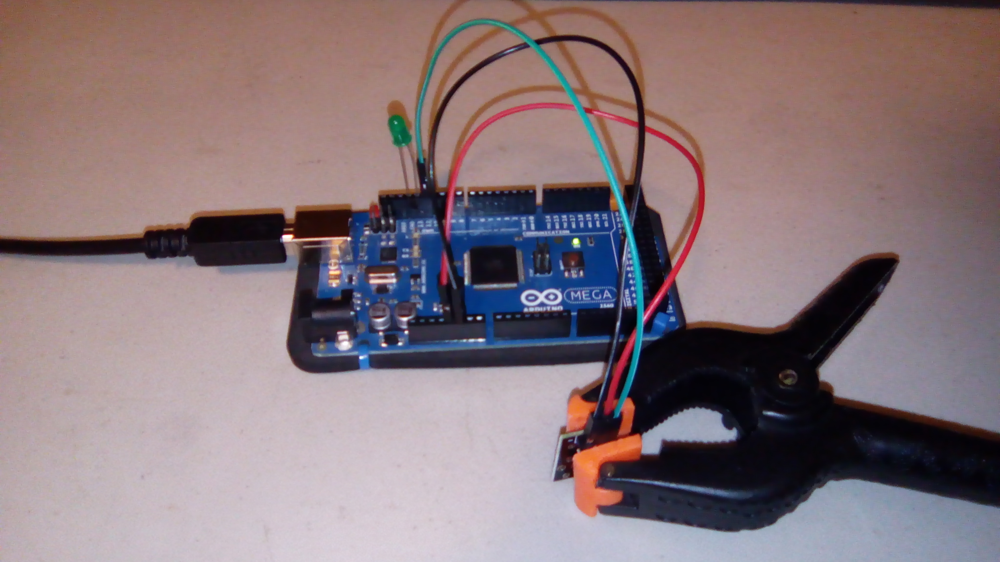
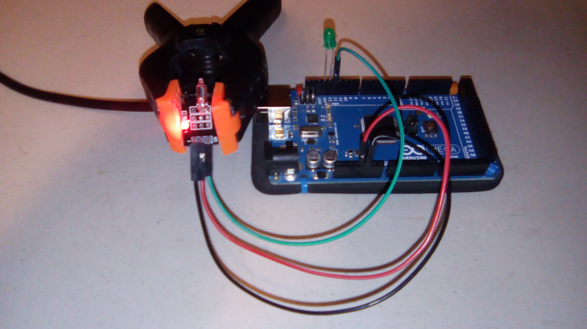

#Switches

This is a sample program for the three pin switches. The code is based on the provided sample code.

Note, the four pin reed switch works with this program, using the DO (Digital Out) pin for output. It has its own project for the analog out.

##Hardware
This uses the following wires:
- Red: 5V to 5V in
- Black: GND to GND (-)
- Green: Signal input from switch.

The pins on each particular switch is shown below. For the three pin modules, GND is marked as `-`, VCC is the middle pin, and the signal pin is marked with a `S`. For the big reed switch, the pins are marked as `AO`, `-`, `+`, and `DO`. Use the `-`, `+`, and `DO`.

This sketch uses pin 12 of an Arduino Mega for the signal input, pin 13 for output to LED, and the 5V and GND pins for power. The LED is plugged directly in to the Arduino.

####Contact Switches
This is the button switch. The signal is `HIGH` when the button is not pressed, and `LOW` when it is.

####Positional Switches
These switch depending on their 3D position. When tilted one way, they output `HIGH`; when another way, `LOW`.

This is the ball switch. 

This is the tilt switch. 

####Magnetic Switches
These switch depending on if they feel a magnetic force nearby.

This is the small reed switch. When there is a magnetic force nearby, the output is `LOW`; otherwise, `HIGH`.

This is the big reed switch, using the DO (Digital Out) pin. When there is a magnetic force nearby, the output is `HIGH`; otherwise, `LOW`; this is reversed from the small reed switch. 

A different project uses the AO (Analog Out) pin.

