#Two Color RGB

This is an example program for either of the two color RGB modules. Adapted from the included code.

This is very similar to the RGB_SMD and RGB_LED projects. 

##Hardware
Wires are optional in this project. 

This uses the following connections:

- Arduino:
  - Pin 12 to pin G of module.
  - Pin 13 to pin R of module.
  - The next pin over (GND) on the arduino to GND of module (-)

The reason this doesn't require wires is that the module can be plugged directly into those three pins of the arduino. Make sure you have the module facing the right way though!

With the pins pointing down and the front facing forward, the pins from left to right are GND, R, and G.

## Explanation:

Computers typically use color codes such as RGB (red, green, blue) or HEX (hexadecimal) to encode colors. These two are very similar, but there are others such as HSV (hue, saturation, value) that are more useful for other applications than shining light. 

Computer monitors use pixels with three bands of light: red, green, and blue. These are the primary colors of light, and these three bands of light mix colors to produce a final color, which is what you see. 

In the RGB encoding, there are three values used; one for how much of each color to shine. The higher the number, the stronger that color shines.

This program iterates through all possible (integer) codes for the colors, creating a gradient that shifts from red to blue to green and back, passing through secondary colors on the way by.

#### Examples

`(255, 0, 0)` is red. This is because there is 100% of the possible red shining, but none of the other two colors.

`(100, 0, 100)` is dark purple. There is a little bit of both red and blue shining.

#### Mixing

Red + blue = purple

Red + green = yellow

Blue + green = aqua

## Final Product
In theory, because the LEDs can output both red and green, they could also output yellow, but it doesn't work very well. In one, green overwhelms the red; in the other, the red overwhelms the green. Thus, there's only a little bit of yellow tint when there is any.

Note, the LED looks much better than the pictures make it look. The camera doesn't capture color very well.

###Hardware design

####3mm LED
####With wires:

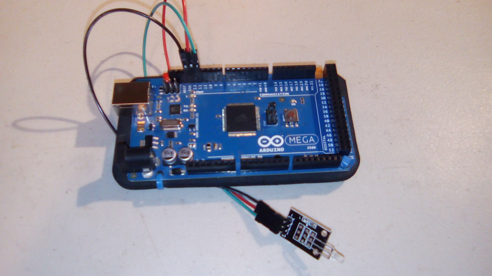

####Without wires:

(Front)
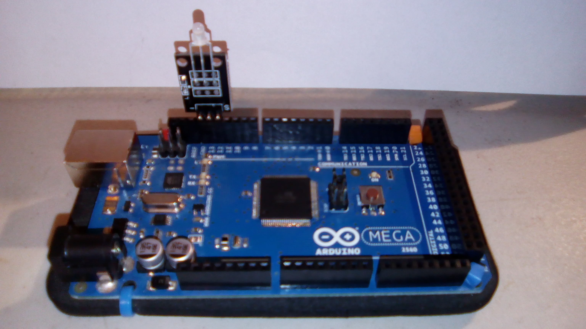

(back)
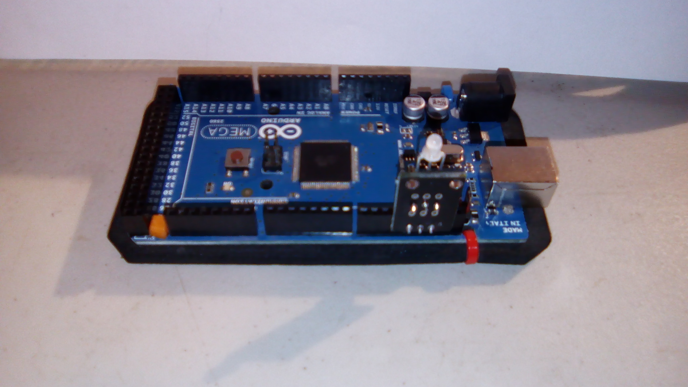

#### 5mm LED
####With wires:

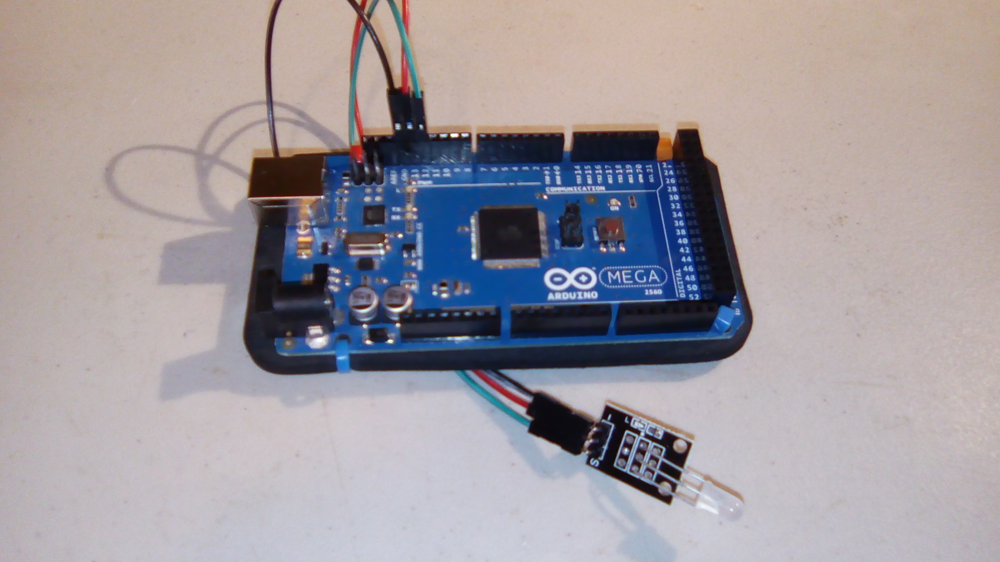

####Without wires:

(Front)
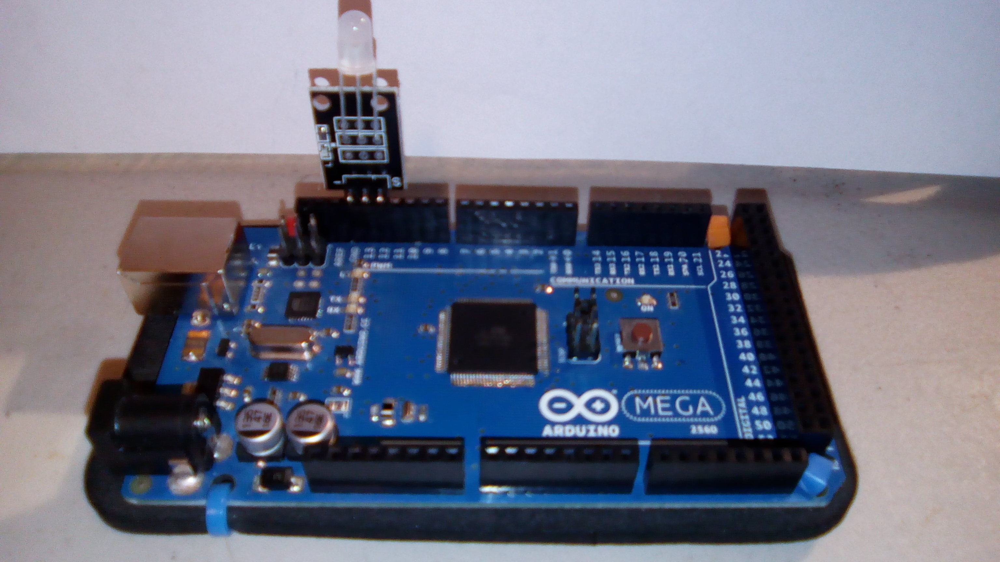

(back)
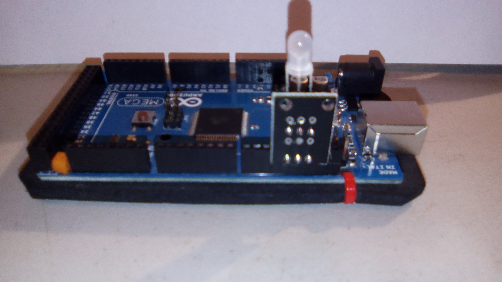

###A few pictures of the colors generated by the program
####3mm (yellow is drowned out by red)

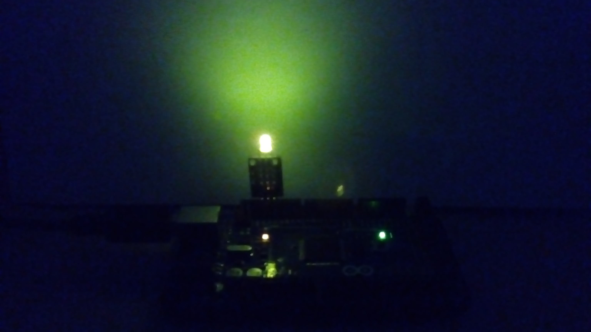

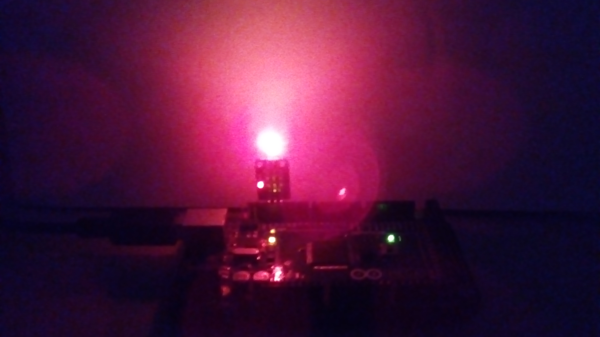

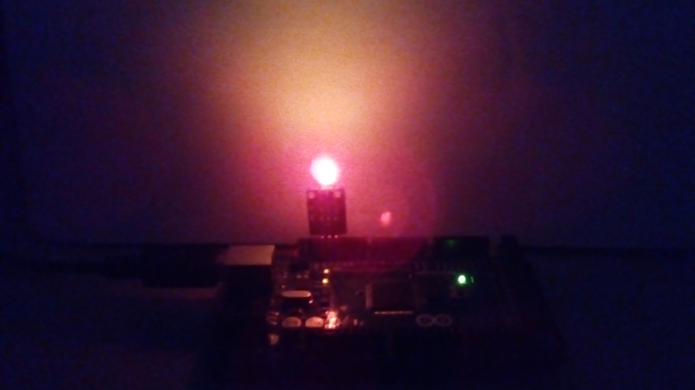

####5mm (yellow is drowned out by green)

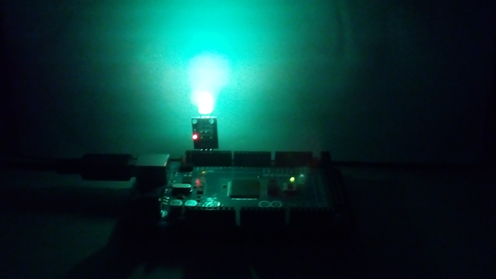

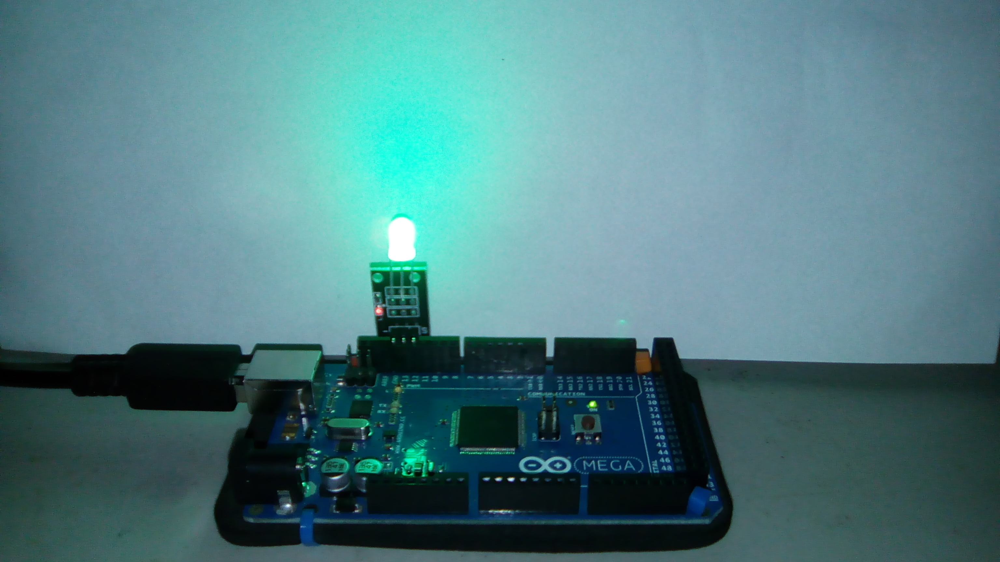

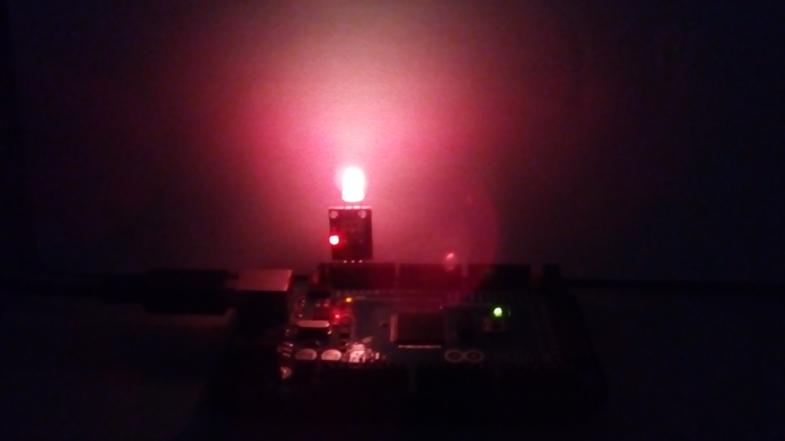
"yellow"
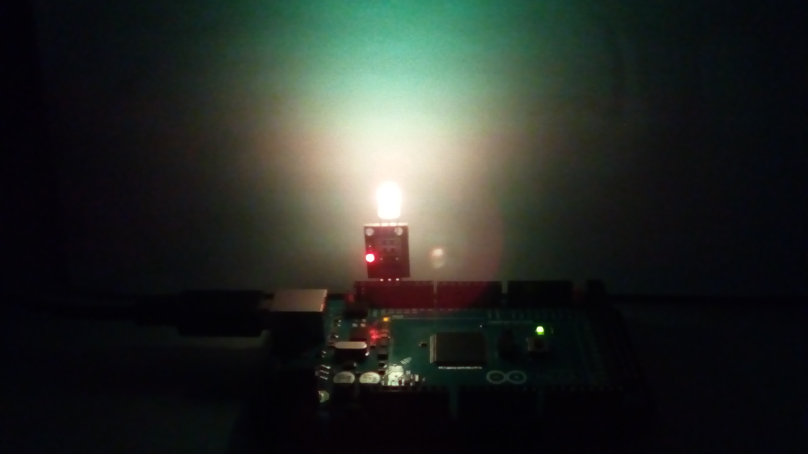

Apologies for the picture quality; these were taken with a phone camera.