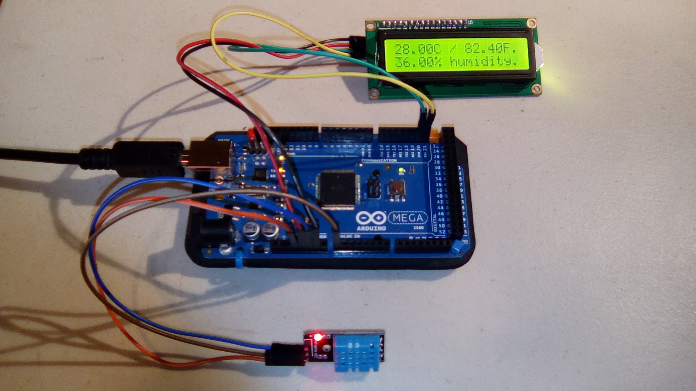
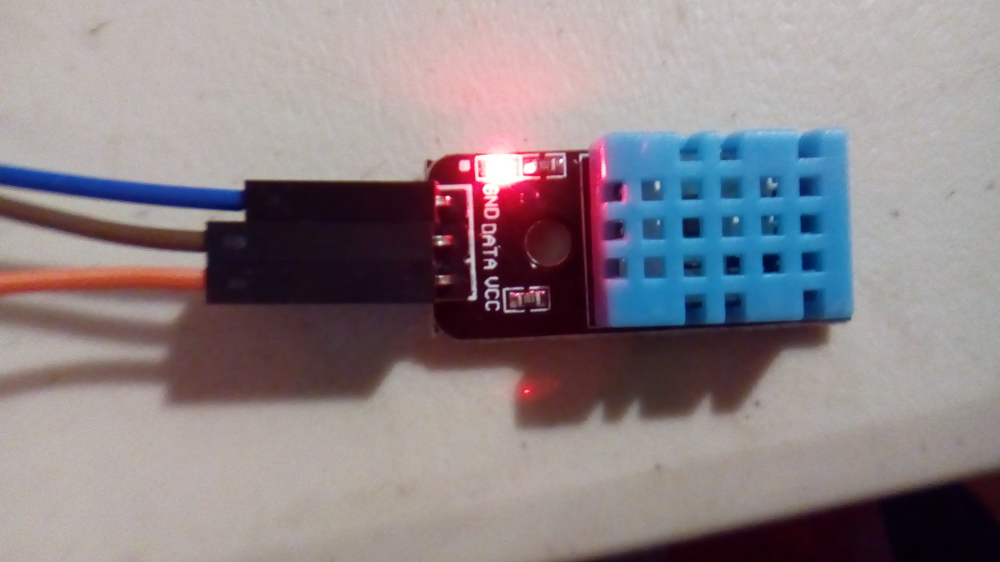
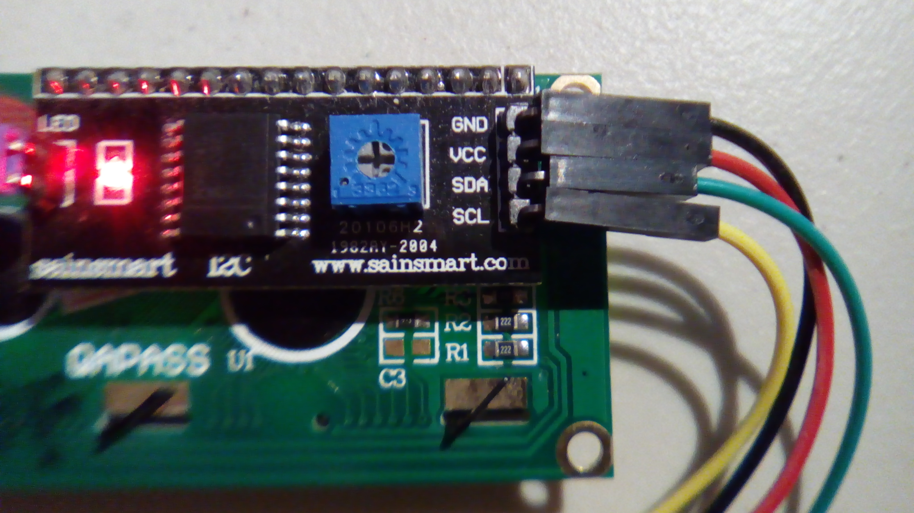

#Weather Station

This is an expanded program for the DHT11 Temperature and Humidity module. This is a combination of the basic program for it and the basic program for the LCD module.

##Hardware

This uses the following wires:
- Arduino to LCD:
  - Red: 5V to VCC
  - Black: GND to GND
  - Green: SDA (pin 20 on an Arduino Mega) to SDA
  - Yellow: SCL (pin 21 on an Arduino Mega) to SCL

- Arduino to DHT11:

  - Orange: 3V to VCC
  - Blue: GND to GND
  - Brown: Analog pin 0 to DATA

With the pins pointing down and the DHT module facing forward, the pins from left to right are GND, DATA, and VCC.

With the pins pointing down and the LCD screen facing away, the pins from left to right are SCL, SDA, VCC, and GND.

See the example program for the LCD screen for possible issues.

Picture warping due to camera focus method.
