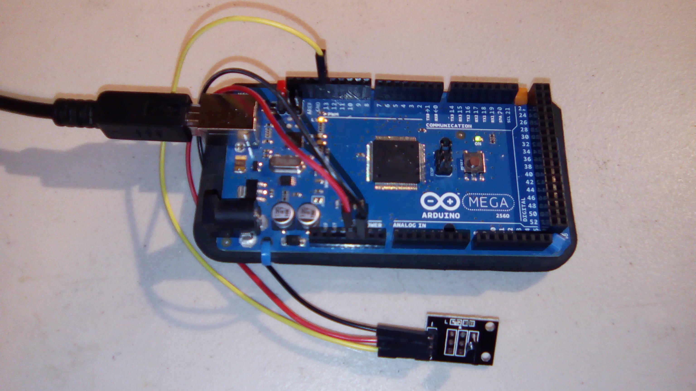

#DS18B20 Temperature  Sensor

This is an example program for the DS18B20 Temperature module. Adapted from the code included with the module.

## Software

This project requires the OneWire library, included as a zip. It was downloaded from http://playground.arduino.cc/Learning/OneWire .

To include this library, in the Arduino menu go to Sketch --> Import Library --> Add Library and then select the .zip file.

##Hardware

This uses the following wires:
- Arduino:
  - Red: 3V to VCC
  - Black: GND to GND
  - Yellow:  Pin 13 to S

With the pins pointing down and the module facing forward, the pins from left to right are GND, VCC, and S.

## Final Product

Sample output: `Temperature: 27.31C, 81.16F`

