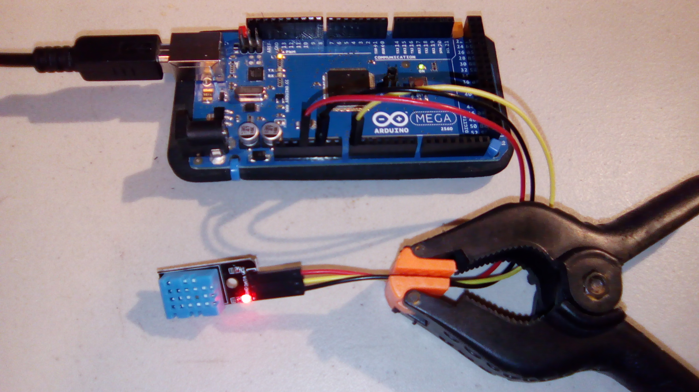

#DHT11 Temperature and Humidity Sensor

This is an example program for the DHT11 Temperature and Humidity module. Adapted from the code included with the module.

See also http://www.uugear.com/portfolio/dht11-humidity-temperature-sensor-module/ for information on how this sensor works and why the code is the way it is.

##Hardware
This uses the following wires:
- Arduino:
  - Red: 3V to VCC
  - Black: GND to GND
  - Yellow: Signal to/from DATA

With the pins pointing down and the module facing forward, the pins from left to right are GND, DATA, and VCC.

## Final Product

Sample output: `27.00 C / 80.60 F. 35.00% humidity.`

What's the clamp for? It's because I could *not* get the sensor to lay on the desk properly.

